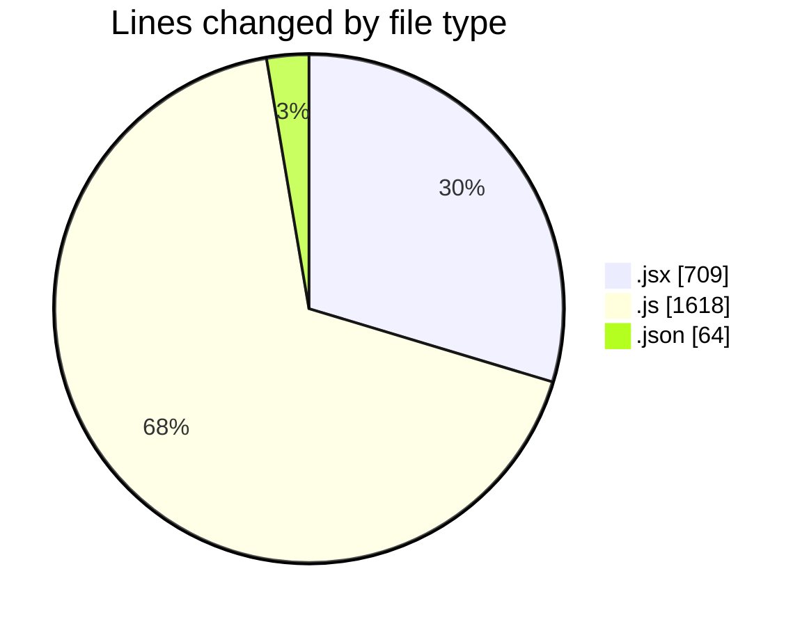
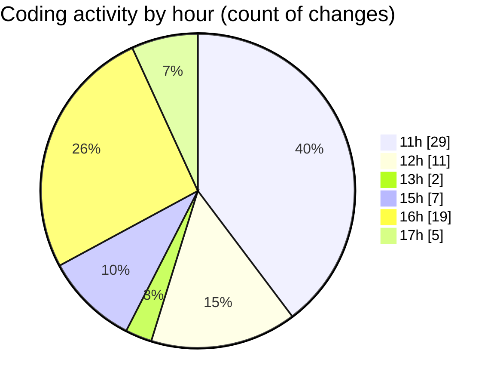

# nxtqube_webapp - Activity Summary 

## Overall Statistics

| Stat                   | Value                                                             |
| ---------------------- | ----------------------------------------------------------------- |
| **Lines Added** (➕)   | 2028                                          |
| **Lines Removed** (➖) | 363                                        |
| **Net Change** (↕)    | 1665                |
| **Active Time** (⌚)   | 84 minutes |

## Modified Files
- **Existing.jsx** (+391, -51)
- **fenceData.route.js** (+112, -53)
- **Mission.jsx** (+210, -0)
- **App.jsx** (+57, -0)
- **mission.route.js** (+113, -46)
- **routes.js** (+105, -9)
- **settings.json** (+64, -0)
- **mission.controller.js** (+302, -12)
- **fenceData.controller.js** (+388, -192)
- **mission.validator.js** (+169, -0)
- **fence.validator.js** (+117, -0)

## Visualizations

### By File Type (Lines Changed)

### By Hour (Estimated Activity Count)

> **Last Updated:** 05/11/2025, 17:52:12