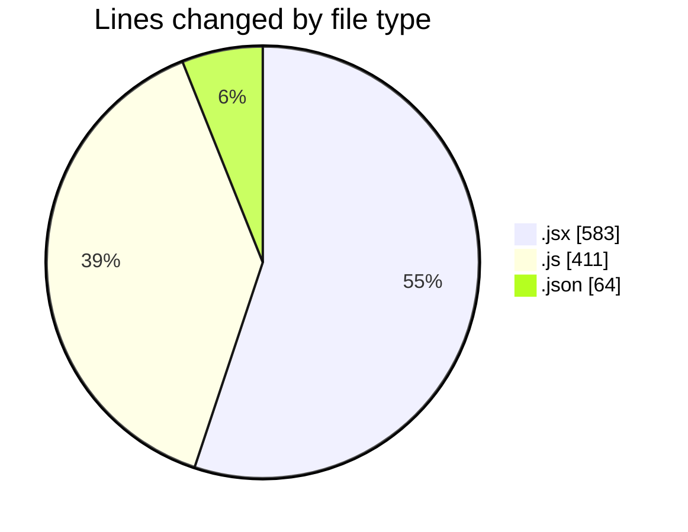
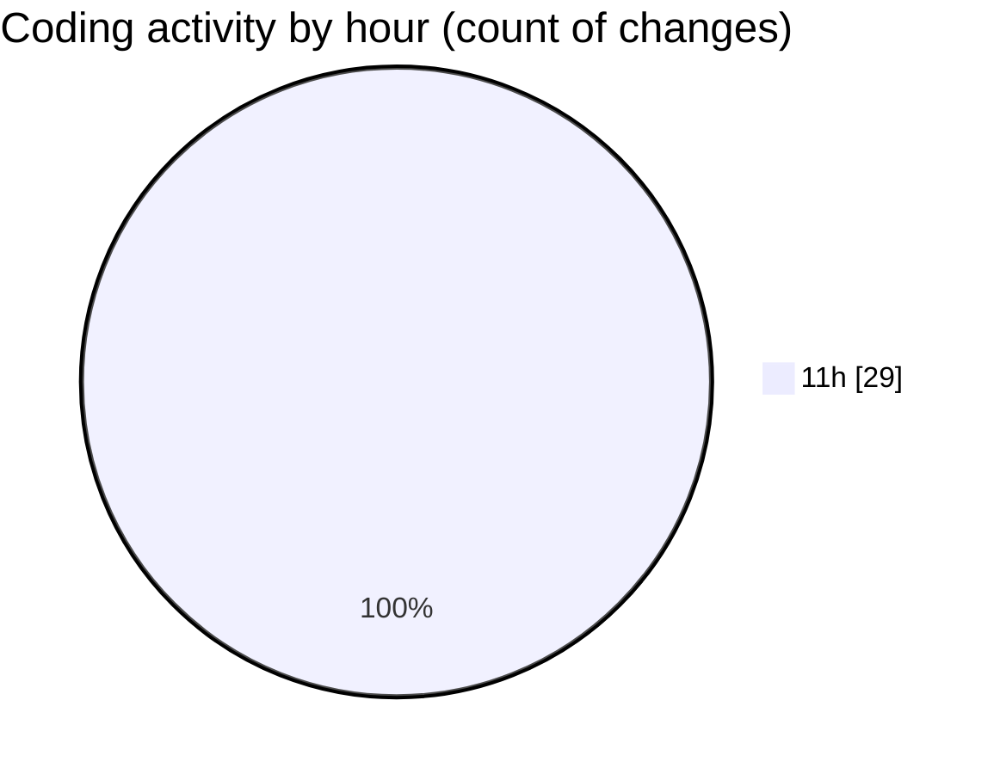

# nxtqube_webapp - Activity Summary 

## Overall Statistics

| Stat                   | Value                                                             |
| ---------------------- | ----------------------------------------------------------------- |
| **Lines Added** (➕)   | 954                                          |
| **Lines Removed** (➖) | 104                                        |
| **Net Change** (↕)    | 850                |
| **Active Time** (⌚)   | 38 minutes |

## Modified Files
- **Existing.jsx** (+301, -15)
- **fenceData.route.js** (+111, -46)
- **Mission.jsx** (+210, -0)
- **App.jsx** (+57, -0)
- **mission.route.js** (+109, -36)
- **routes.js** (+102, -7)
- **settings.json** (+64, -0)

## Visualizations

### By File Type (Lines Changed)

### By Hour (Estimated Activity Count)

> **Last Updated:** 05/11/2025, 12:03:18