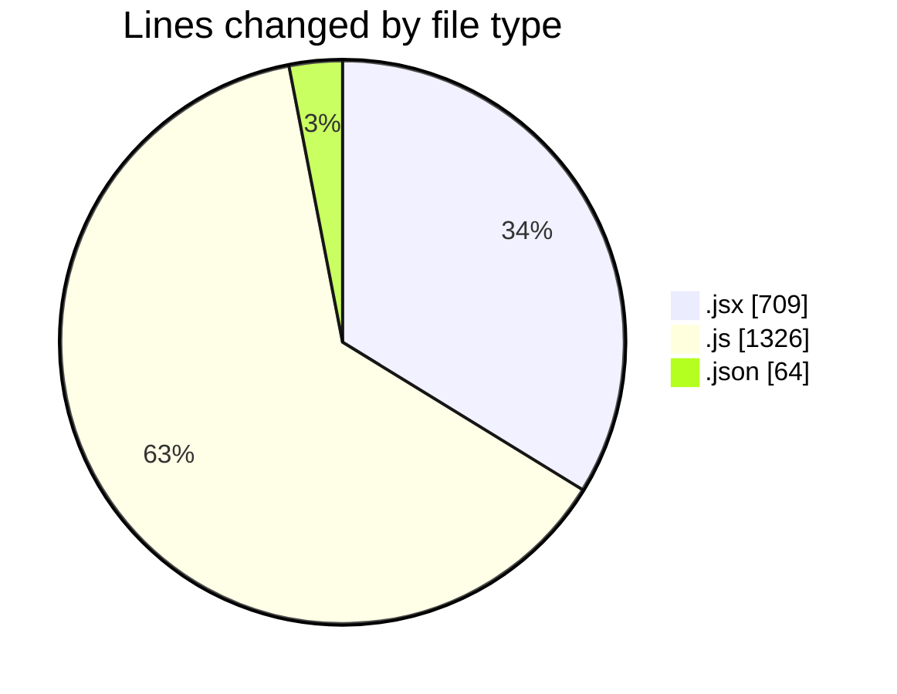
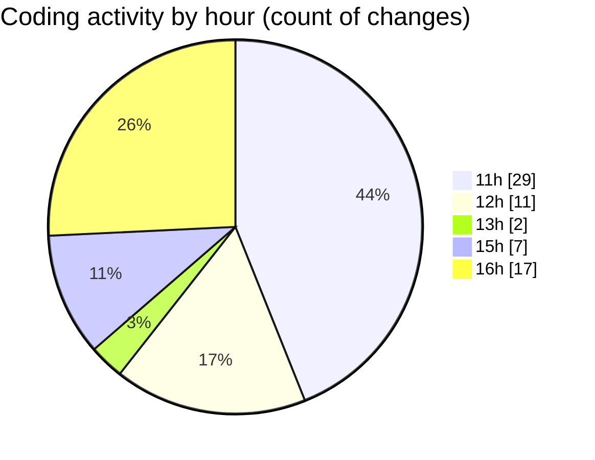

# nxtqube_webapp - Activity Summary 

## Overall Statistics

| Stat                   | Value                                                             |
| ---------------------- | ----------------------------------------------------------------- |
| **Lines Added** (➕)   | 1738                                          |
| **Lines Removed** (➖) | 361                                        |
| **Net Change** (↕)    | 1377                |
| **Active Time** (⌚)   | 82 minutes |

## Modified Files
- **Existing.jsx** (+391, -51)
- **fenceData.route.js** (+112, -53)
- **Mission.jsx** (+210, -0)
- **App.jsx** (+57, -0)
- **mission.route.js** (+109, -44)
- **routes.js** (+105, -9)
- **settings.json** (+64, -0)
- **mission.controller.js** (+302, -12)
- **fenceData.controller.js** (+388, -192)

## Visualizations

### By File Type (Lines Changed)

### By Hour (Estimated Activity Count)

> **Last Updated:** 05/11/2025, 16:27:21