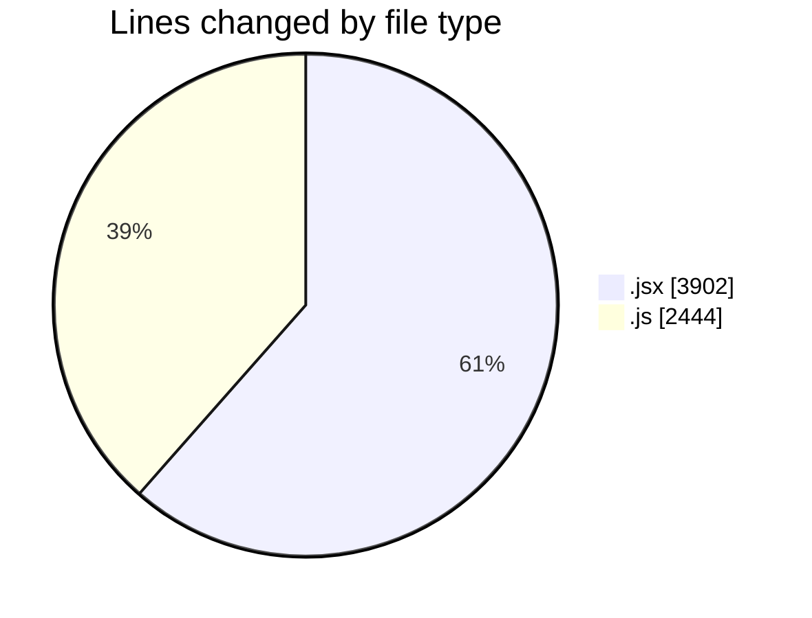
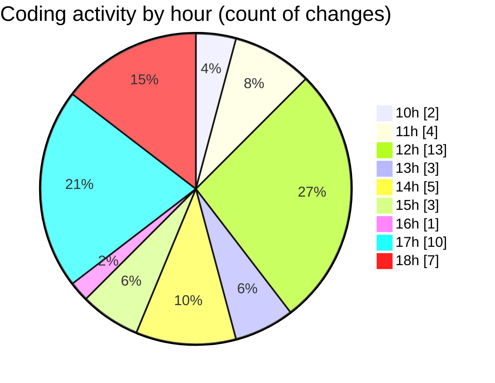

# nxtqube_webapp - Activity Summary 

## Overall Statistics

| Stat                   | Value                                                             |
| ---------------------- | ----------------------------------------------------------------- |
| **Lines Added** (➕)   | 6252                                          |
| **Lines Removed** (➖) | 94                                        |
| **Net Change** (↕)    | 6158                |
| **Active Time** (⌚)   | 39 minutes |

## Modified Files
- **Existing.jsx** (+397, -63)
- **ExistingMission.jsx** (+492, -0)
- **createMissionHome.jsx** (+705, -25)
- **locationService.js** (+192, -0)
- **calculateTime.js** (+171, -0)
- **mission.validator.js** (+211, -0)
- **HandleAddWaypointOnclick.js** (+443, -0)
- **missionUtils.js** (+273, -0)
- **routes.js** (+96, -0)
- **createGridMission.jsx** (+2088, -6)
- **SaveMissionModal.jsx** (+126, -0)
- **gridMissionUtils.js** (+1058, -0)

## Visualizations

### By File Type (Lines Changed)

### By Hour (Estimated Activity Count)

> **Last Updated:** 06/11/2025, 18:27:30