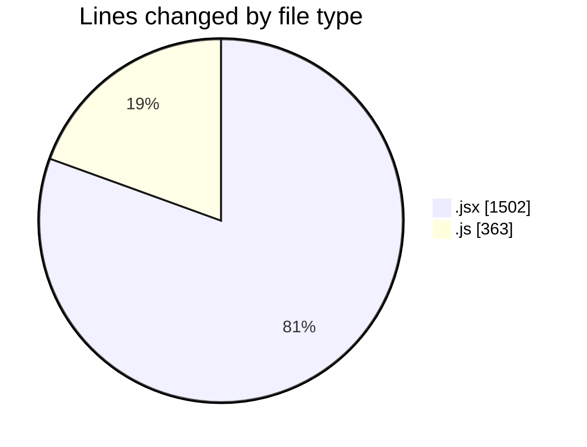
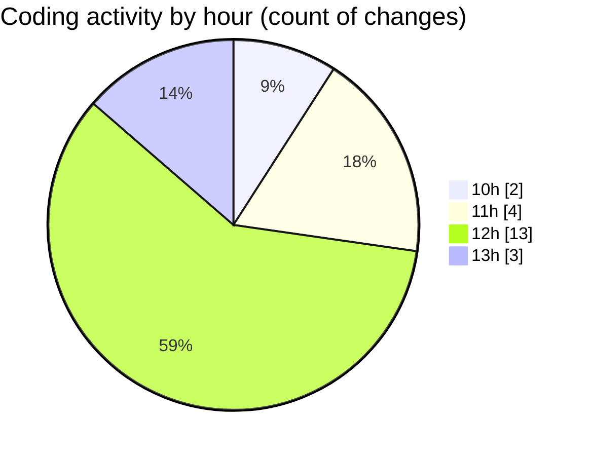

# nxtqube_webapp - Activity Summary 

## Overall Statistics

| Stat                   | Value                                                             |
| ---------------------- | ----------------------------------------------------------------- |
| **Lines Added** (➕)   | 1842                                          |
| **Lines Removed** (➖) | 23                                        |
| **Net Change** (↕)    | 1819                |
| **Active Time** (⌚)   | 19 minutes |

## Modified Files
- **Existing.jsx** (+341, -7)
- **ExistingMission.jsx** (+481, -0)
- **createMissionHome.jsx** (+657, -16)
- **locationService.js** (+192, -0)
- **calculateTime.js** (+171, -0)

## Visualizations

### By File Type (Lines Changed)

### By Hour (Estimated Activity Count)

> **Last Updated:** 06/11/2025, 13:21:28