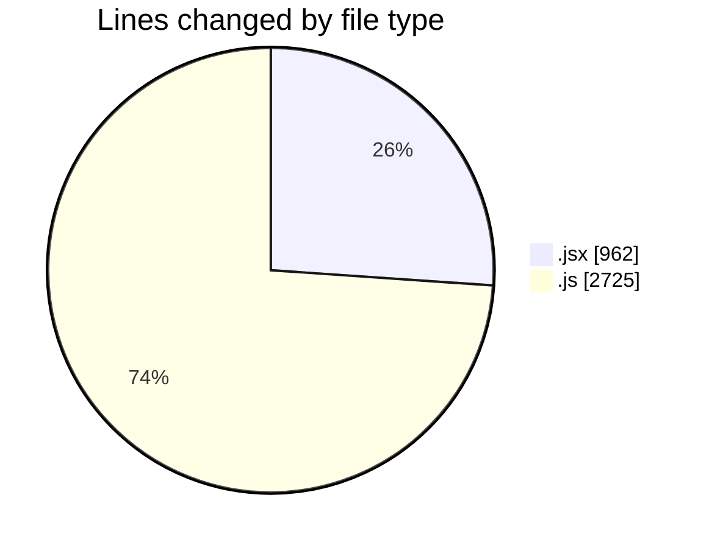
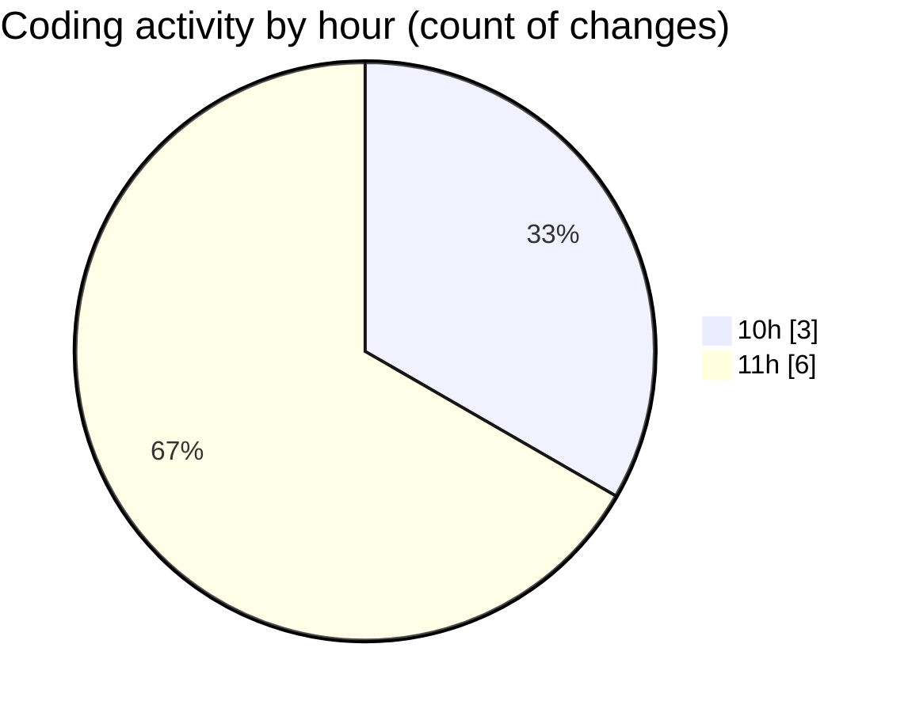

# nxtqube_webapp - Activity Summary 

## Overall Statistics

| Stat                   | Value                                                             |
| ---------------------- | ----------------------------------------------------------------- |
| **Lines Added** (➕)   | 3686                                          |
| **Lines Removed** (➖) | 1                                        |
| **Net Change** (↕)    | 3685                |
| **Active Time** (⌚)   | 15 minutes |

## Modified Files
- **CreateFenceForm.jsx** (+961, -1)
- **fence.validator.js** (+117, -0)
- **fenceData.controller.js** (+196, -0)
- **useFenceManagement.js** (+2328, -0)
- **showFences.js** (+84, -0)

## Visualizations

### By File Type (Lines Changed)

### By Hour (Estimated Activity Count)

> **Last Updated:** 07/11/2025, 11:18:35