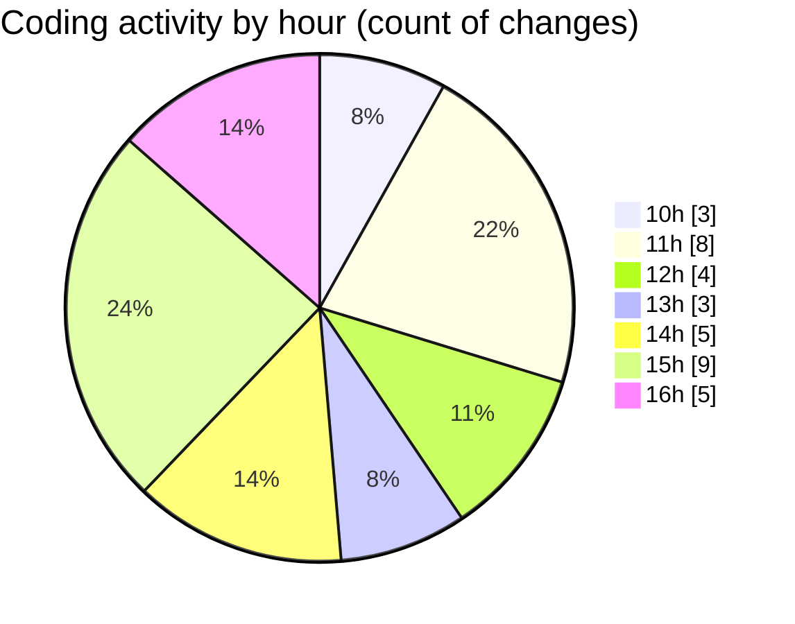

# nxtqube_webapp - Activity Summary 

## Overall Statistics

| Stat                   | Value                                                             |
| ---------------------- | ----------------------------------------------------------------- |
| **Lines Added** (➕)   | 4626                                          |
| **Lines Removed** (➖) | 34                                        |
| **Net Change** (↕)    | 4592                |
| **Active Time** (⌚)   | 42 minutes |

## Modified Files
- **CreateFenceForm.jsx** (+979, -11)
- **fence.validator.js** (+117, -0)
- **fenceData.controller.js** (+196, -0)
- **useFenceManagement.js** (+2366, -17)
- **showFences.js** (+84, -0)
- **ExistingFenceForm.jsx** (+497, -6)
- **geofence.jsx** (+345, -0)
- **DroneFenceFormat.js** (+42, -0)

## Visualizations

### By File Type (Lines Changed)

### By Hour (Estimated Activity Count)

> **Last Updated:** 07/11/2025, 16:53:56