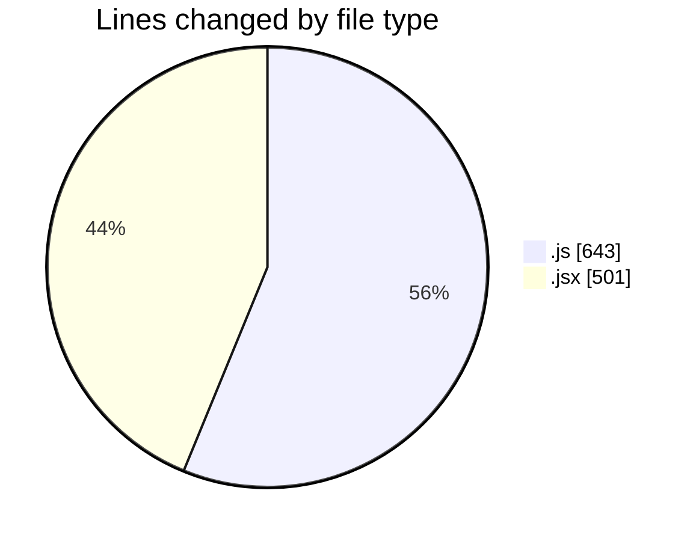
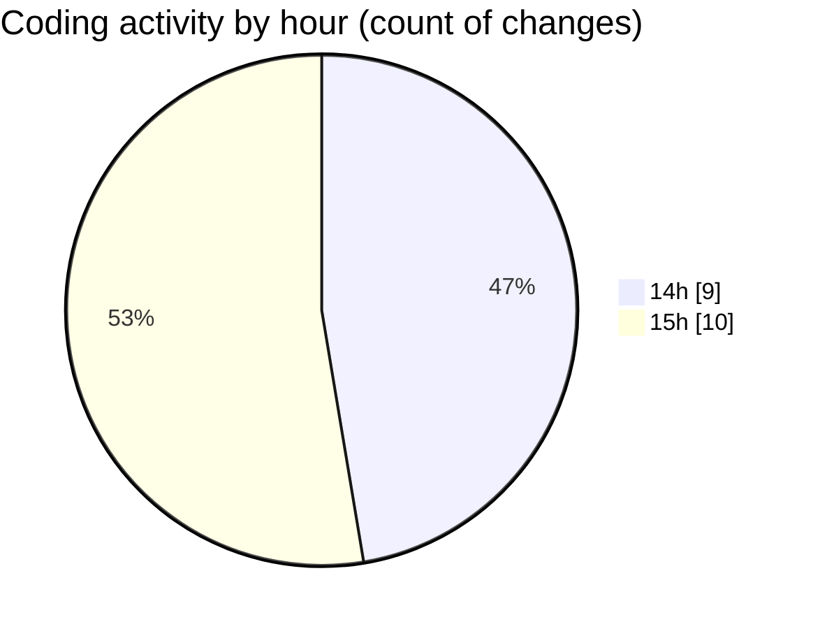

# nxtqube_webapp - Activity Summary 

## Overall Statistics

| Stat                   | Value                                                             |
| ---------------------- | ----------------------------------------------------------------- |
| **Lines Added** (➕)   | 1035                                          |
| **Lines Removed** (➖) | 109                                        |
| **Net Change** (↕)    | 926                |
| **Active Time** (⌚)   | 24 minutes |

## Modified Files
- **missionUtils.js** (+356, -56)
- **ExistingFenceForm.jsx** (+501, -0)
- **fenceData.route.js** (+95, -36)
- **mission.route.js** (+83, -17)

## Visualizations

### By File Type (Lines Changed)

### By Hour (Estimated Activity Count)

> **Last Updated:** 09/11/2025, 15:21:48