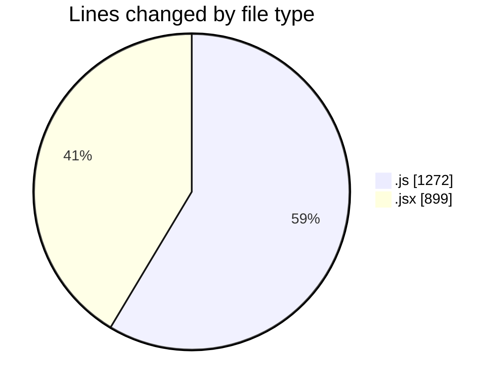
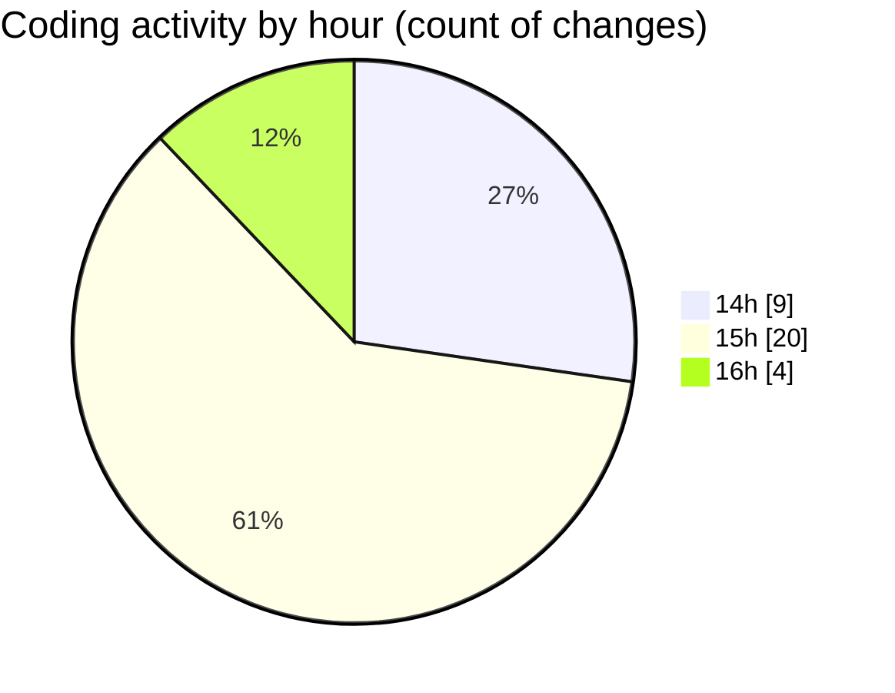

# nxtqube_webapp - Activity Summary 

## Overall Statistics

| Stat                   | Value                                                             |
| ---------------------- | ----------------------------------------------------------------- |
| **Lines Added** (➕)   | 1971                                          |
| **Lines Removed** (➖) | 200                                        |
| **Net Change** (↕)    | 1771                |
| **Active Time** (⌚)   | 41 minutes |

## Modified Files
- **missionUtils.js** (+356, -56)
- **ExistingFenceForm.jsx** (+501, -0)
- **fenceData.route.js** (+95, -36)
- **mission.route.js** (+83, -17)
- **routes.js** (+122, -24)
- **scheduledMissions.routes.js** (+38, -3)
- **flow.route.js** (+33, -0)
- **missionLog.route.js** (+41, -0)
- **Existing.jsx** (+334, -64)
- **mission.controller.js** (+368, -0)

## Visualizations

### By File Type (Lines Changed)

### By Hour (Estimated Activity Count)

> **Last Updated:** 09/11/2025, 16:41:49