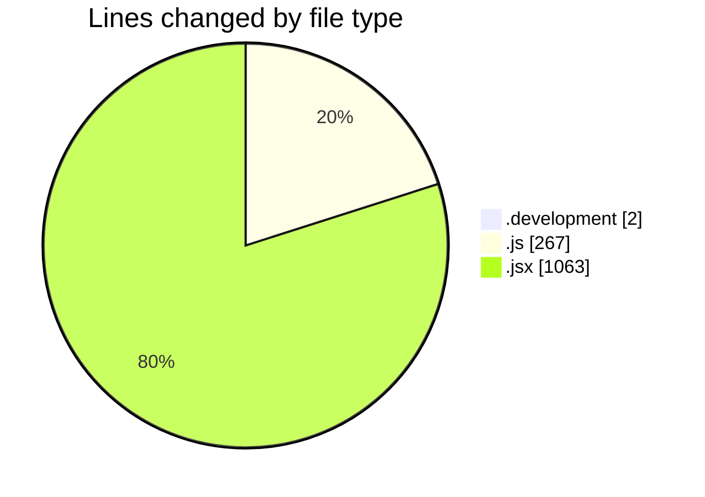
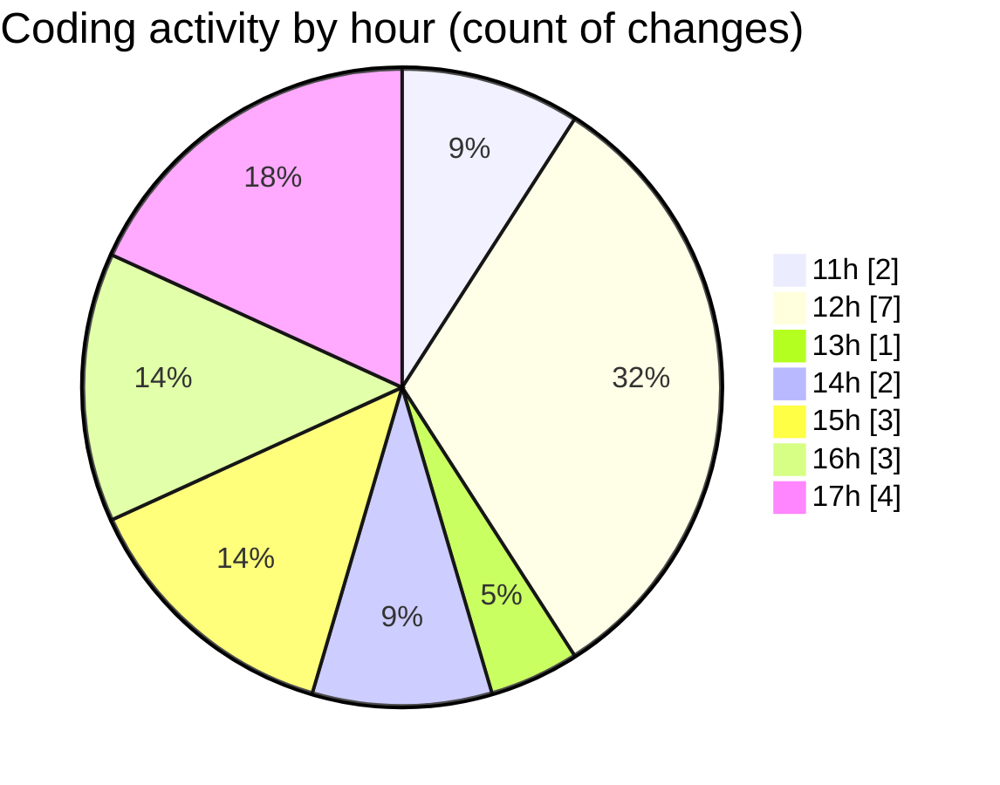

# nxtqube_webapp - Activity Summary 

## Overall Statistics

| Stat                   | Value                                                             |
| ---------------------- | ----------------------------------------------------------------- |
| **Lines Added** (➕)   | 1316                                          |
| **Lines Removed** (➖) | 16                                        |
| **Net Change** (↕)    | 1300                |
| **Active Time** (⌚)   | 17 minutes |

## Modified Files
- **.env.development** (+2, -0)
- **droneCommand.controller.js** (+46, -11)
- **LaunchModel.jsx** (+446, -0)
- **LaunchControl.jsx** (+613, -4)
- **DroneDefaultsByUser.controller.js** (+151, -1)
- **drone.command.validator.js** (+33, -0)
- **droneCommand.route.js** (+25, -0)

## Visualizations

### By File Type (Lines Changed)

### By Hour (Estimated Activity Count)

> **Last Updated:** 10/11/2025, 17:23:27