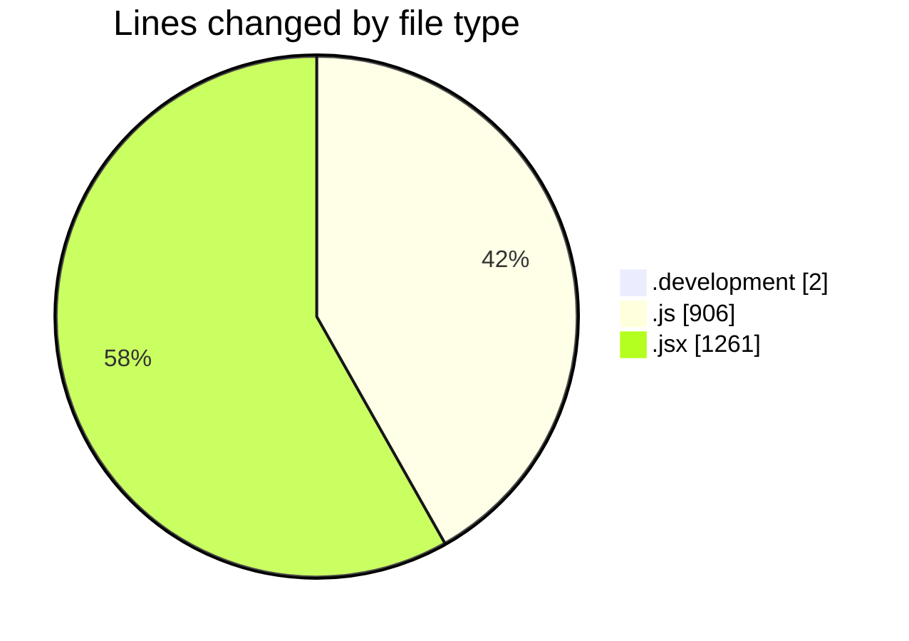
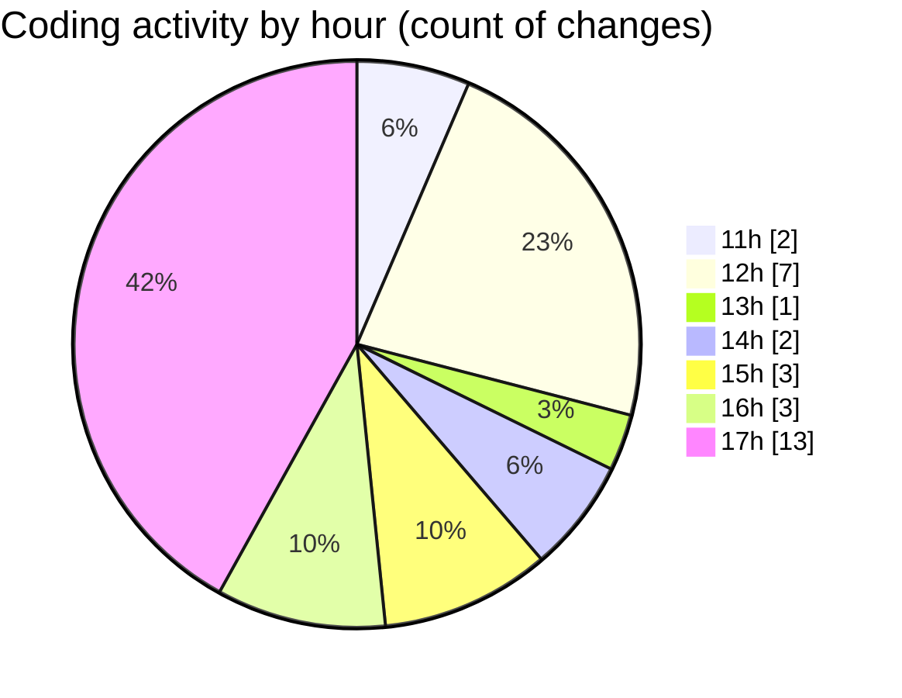

# nxtqube_webapp - Activity Summary 

## Overall Statistics

| Stat                   | Value                                                             |
| ---------------------- | ----------------------------------------------------------------- |
| **Lines Added** (➕)   | 2108                                          |
| **Lines Removed** (➖) | 61                                        |
| **Net Change** (↕)    | 2047                |
| **Active Time** (⌚)   | 29 minutes |

## Modified Files
- **.env.development** (+2, -0)
- **droneCommand.controller.js** (+62, -26)
- **LaunchModel.jsx** (+446, -0)
- **LaunchControl.jsx** (+613, -7)
- **DroneDefaultsByUser.controller.js** (+151, -1)
- **drone.command.validator.js** (+33, -14)
- **droneCommand.route.js** (+25, -13)
- **SelectedDronePreview.jsx** (+195, -0)
- **apiUtils.js** (+191, -0)
- **fenceData.controller.js** (+390, -0)

## Visualizations

### By File Type (Lines Changed)

### By Hour (Estimated Activity Count)

> **Last Updated:** 10/11/2025, 17:48:27