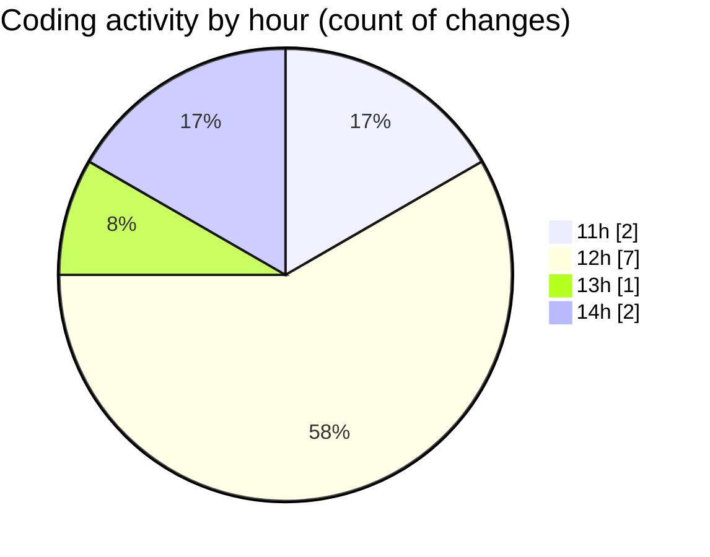

# nxtqube_webapp - Activity Summary 

## Overall Statistics

| Stat                   | Value                                                             |
| ---------------------- | ----------------------------------------------------------------- |
| **Lines Added** (➕)   | 1096                                          |
| **Lines Removed** (➖) | 1                                        |
| **Net Change** (↕)    | 1095                |
| **Active Time** (⌚)   | 9 minutes |

## Modified Files
- **.env.development** (+2, -0)
- **droneCommand.controller.js** (+37, -0)
- **LaunchModel.jsx** (+446, -0)
- **LaunchControl.jsx** (+611, -1)

## Visualizations

### By File Type (Lines Changed)

### By Hour (Estimated Activity Count)

> **Last Updated:** 10/11/2025, 14:06:55