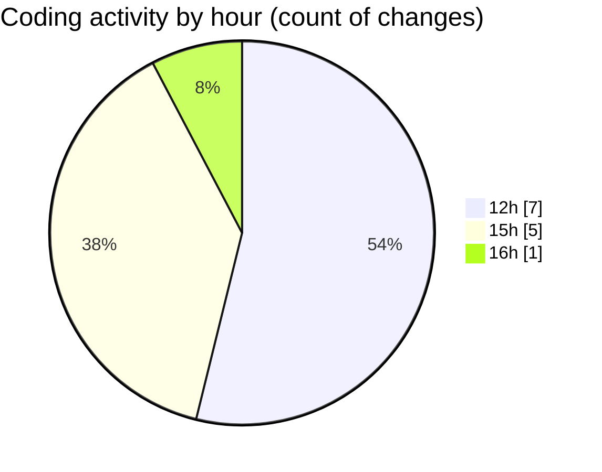

# Argos - Activity Summary 

## Overall Statistics

| Stat                   | Value                                                             |
| ---------------------- | ----------------------------------------------------------------- |
| **Lines Added** (➕)   | 4848                                          |
| **Lines Removed** (➖) | 12                                        |
| **Net Change** (↕)    | 4836                |
| **Active Time** (⌚)   | 10 minutes |

## Modified Files
- **.env.development** (+2, -0)
- **.env.development** (+41, -0)
- **CreateFenceForm.jsx** (+940, -9)
- **CreateFenceForm.jsx** (+985, -0)
- **createPathMission.jsx** (+107, -2)
- **ExistingFenceForm.jsx** (+501, -1)
- **useFenceManagement.js** (+2272, -0)

## Visualizations

### By File Type (Lines Changed)

### By Hour (Estimated Activity Count)

> **Last Updated:** 11/11/2025, 16:07:46