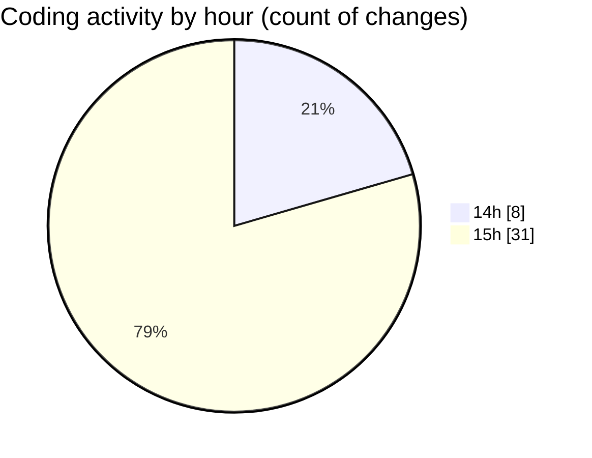

# Argos - Activity Summary 

## Overall Statistics

| Stat                   | Value                                                             |
| ---------------------- | ----------------------------------------------------------------- |
| **Lines Added** (➕)   | 4444                                          |
| **Lines Removed** (➖) | 52                                        |
| **Net Change** (↕)    | 4392                |
| **Active Time** (⌚)   | 40 minutes |

## Modified Files
- **fence.data.model.js** (+77, -15)
- **fenceData.controller.js** (+305, -24)
- **CreateFenceForm.jsx** (+990, -5)
- **createPathMission.jsx** (+107, -0)
- **geofencedock.controller.js** (+76, -0)
- **getUser.js** (+16, -0)
- **ExistingFenceForm.jsx** (+500, -8)
- **removeEntities.js** (+96, -0)
- **useFenceManagement.js** (+2277, -0)

## Visualizations

### By File Type (Lines Changed)

### By Hour (Estimated Activity Count)

> **Last Updated:** 12/11/2025, 15:49:54