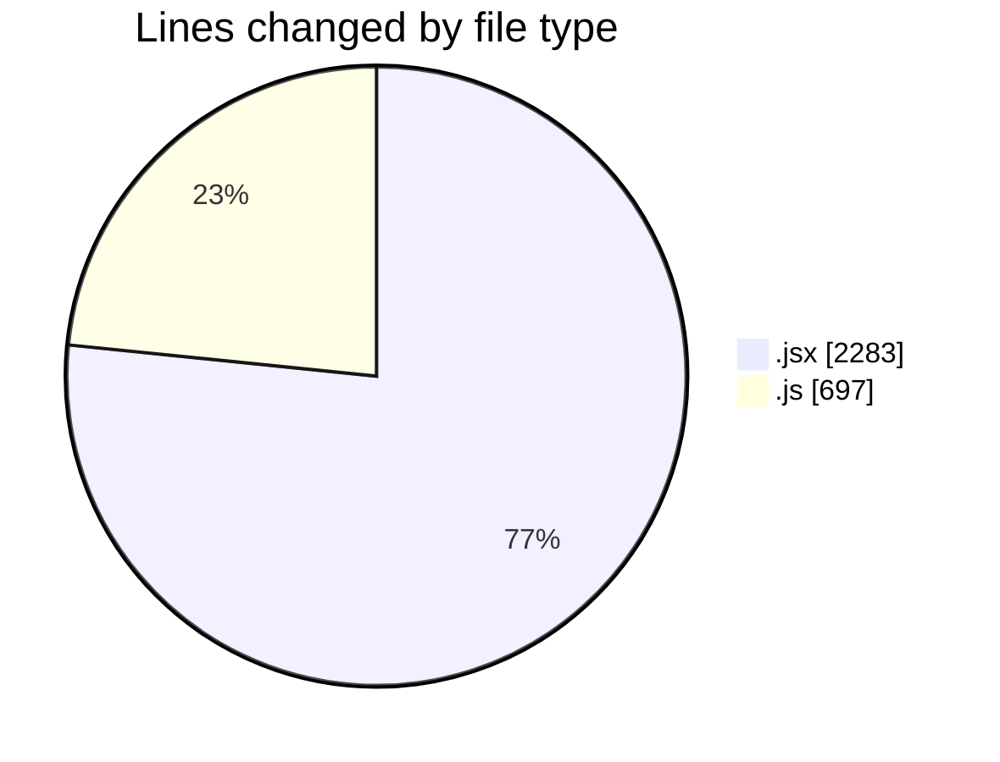
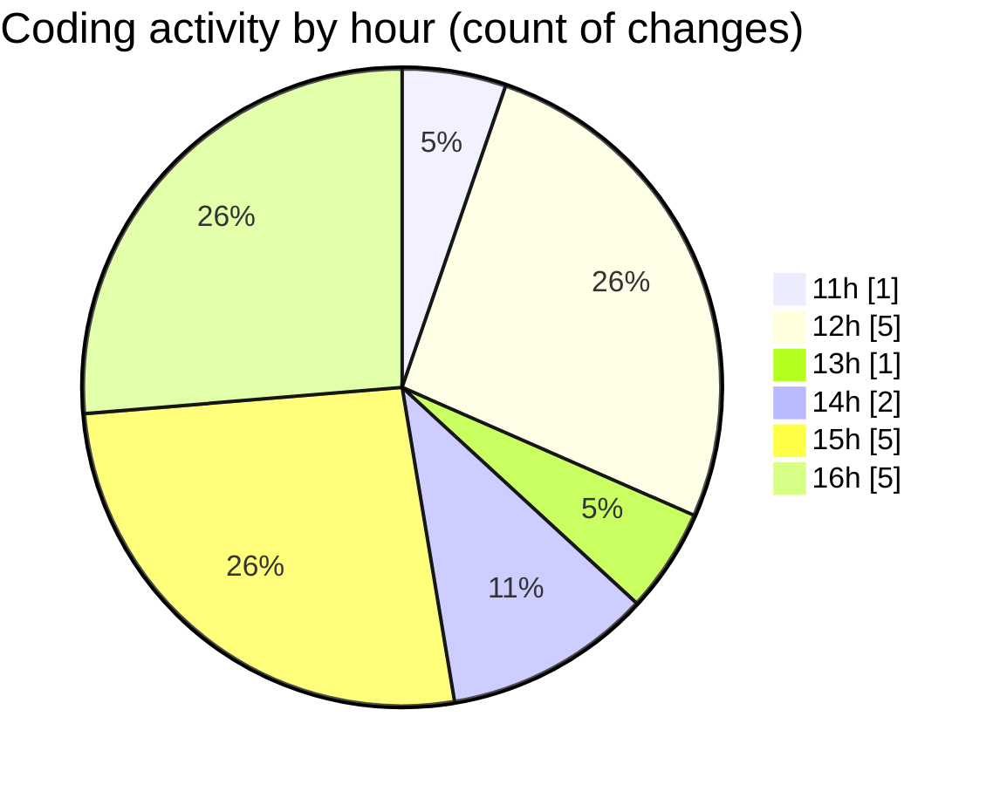

# Argos - Activity Summary 

## Overall Statistics

| Stat                   | Value                                                             |
| ---------------------- | ----------------------------------------------------------------- |
| **Lines Added** (➕)   | 2969                                          |
| **Lines Removed** (➖) | 11                                        |
| **Net Change** (↕)    | 2958                |
| **Active Time** (⌚)   | 13 minutes |

## Modified Files
- **Mission.jsx** (+212, -2)
- **ManageMission.jsx** (+367, -1)
- **Existing.jsx** (+270, -0)
- **ExistingMission.jsx** (+492, -0)
- **LaunchControl.jsx** (+589, -4)
- **calculateTime.js** (+171, -0)
- **HandleAddWaypointOnclick.js** (+450, -0)
- **store.js** (+76, -0)
- **droneCommandHandler.jsx** (+320, -0)
- **sequenceMessageHandler.jsx** (+22, -4)

## Visualizations

### By File Type (Lines Changed)

### By Hour (Estimated Activity Count)

> **Last Updated:** 13/11/2025, 16:43:35