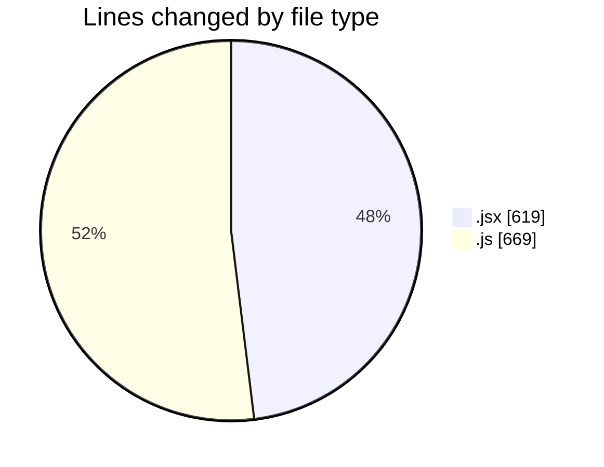
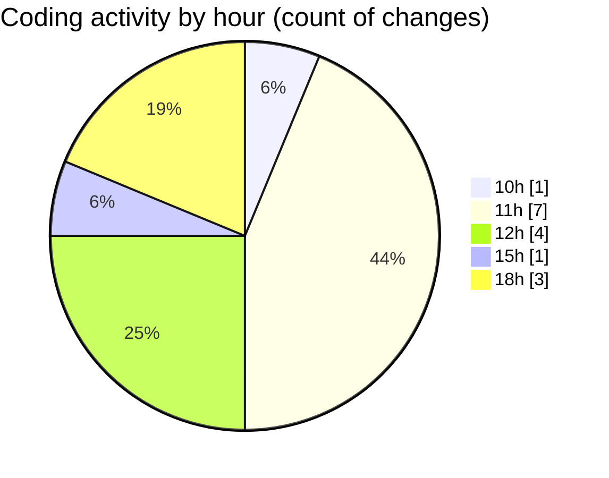

# Argos - Activity Summary 

## Overall Statistics

| Stat                   | Value                                                             |
| ---------------------- | ----------------------------------------------------------------- |
| **Lines Added** (➕)   | 1267                                          |
| **Lines Removed** (➖) | 21                                        |
| **Net Change** (↕)    | 1246                |
| **Active Time** (⌚)   | 20 minutes |

## Modified Files
- **LaunchControl.jsx** (+601, -18)
- **DroneDefaultsByUser.route.js** (+32, -1)
- **DroneDefaultsByUser.controller.js** (+134, -0)
- **dataProcessor.js** (+312, -1)
- **dataGather.js** (+73, -1)
- **10.resource.seeder.js** (+115, -0)

## Visualizations

### By File Type (Lines Changed)

### By Hour (Estimated Activity Count)

> **Last Updated:** 14/11/2025, 18:51:50