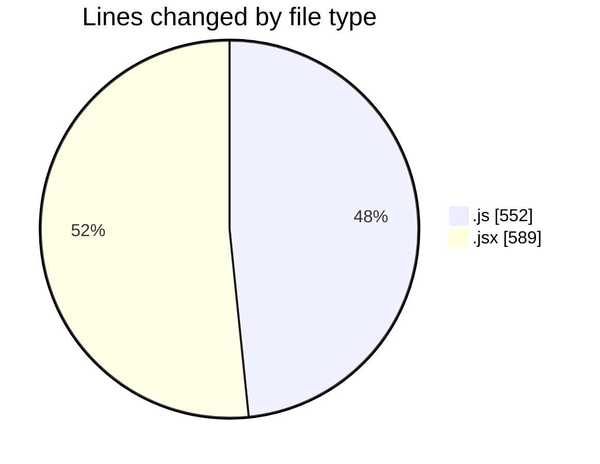
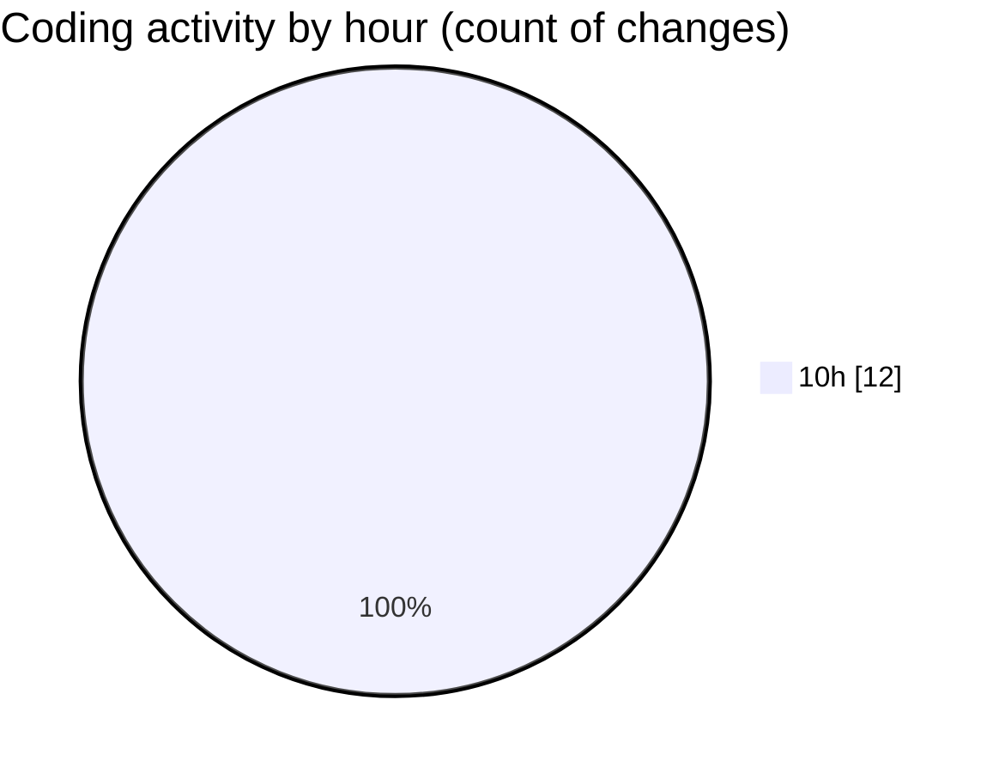

# Argos - Activity Summary 

## Overall Statistics

| Stat                   | Value                                                             |
| ---------------------- | ----------------------------------------------------------------- |
| **Lines Added** (➕)   | 1122                                          |
| **Lines Removed** (➖) | 19                                        |
| **Net Change** (↕)    | 1103                |
| **Active Time** (⌚)   | 22 minutes |

## Modified Files
- **DroneDefaultsByUser.route.js** (+31, -19)
- **10.resource.seeder.js** (+115, -0)
- **dataGather.js** (+73, -0)
- **dataProcessor.js** (+314, -0)
- **LaunchControl.jsx** (+589, -0)

## Visualizations

### By File Type (Lines Changed)

### By Hour (Estimated Activity Count)

> **Last Updated:** 16/11/2025, 10:48:02