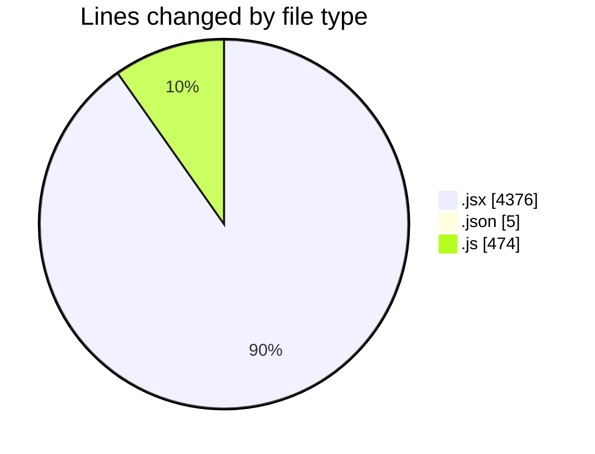
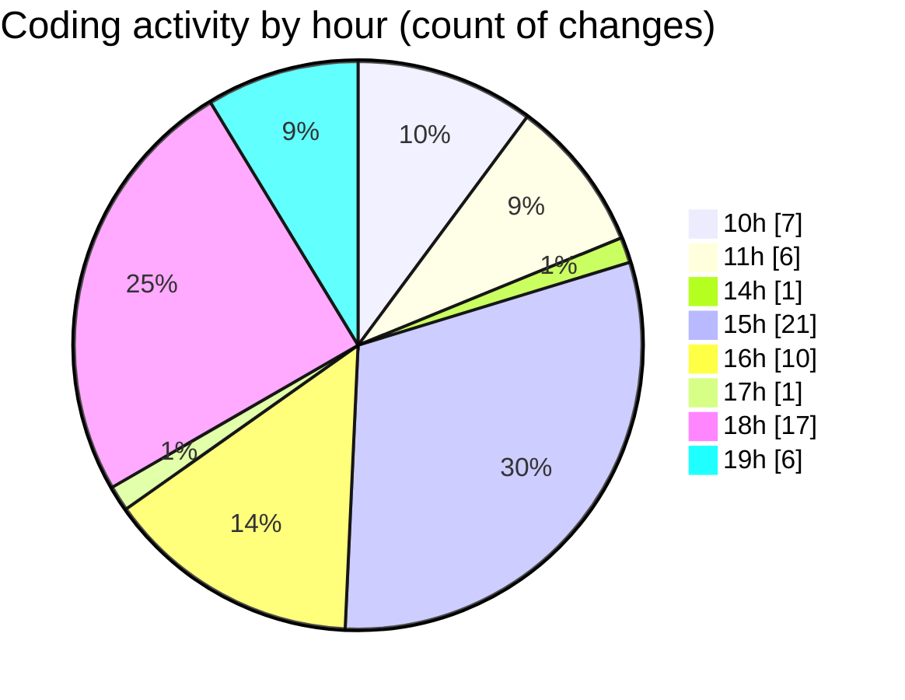

# nxtqube_webapp - Activity Summary 

## Overall Statistics

| Stat                   | Value                                                             |
| ---------------------- | ----------------------------------------------------------------- |
| **Lines Added** (➕)   | 4751                                          |
| **Lines Removed** (➖) | 104                                        |
| **Net Change** (↕)    | 4647                |
| **Active Time** (⌚)   | 114 minutes |

## Modified Files
- **ManageMission.jsx** (+390, -23)
- **createMissionHome.jsx** (+680, -2)
- **MissionInfo.jsx** (+543, -0)
- **MissionControl.jsx** (+2348, -71)
- **settings.json** (+5, -0)
- **WaypointAction.jsx** (+319, -0)
- **HandleAddWaypointOnclick.js** (+466, -8)

## Visualizations

### By File Type (Lines Changed)

### By Hour (Estimated Activity Count)

> **Last Updated:** 18/11/2025, 19:08:19