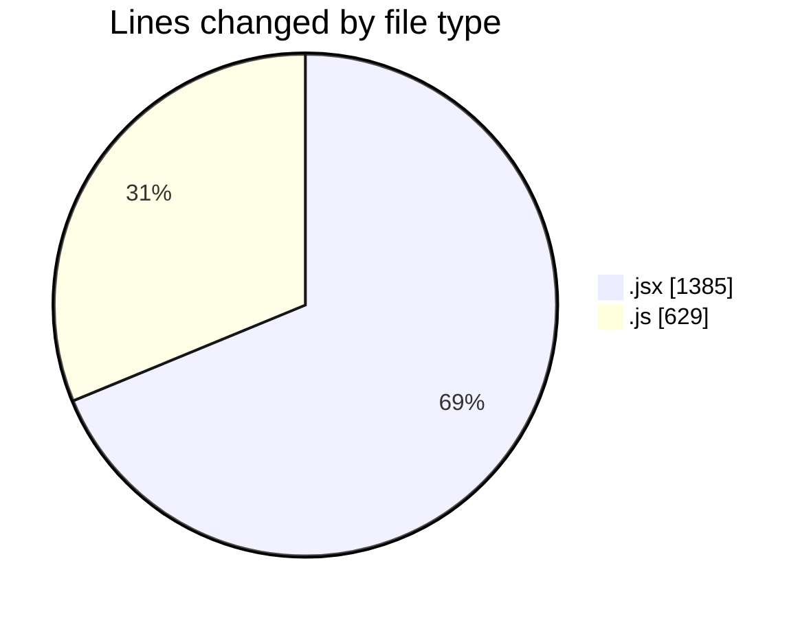
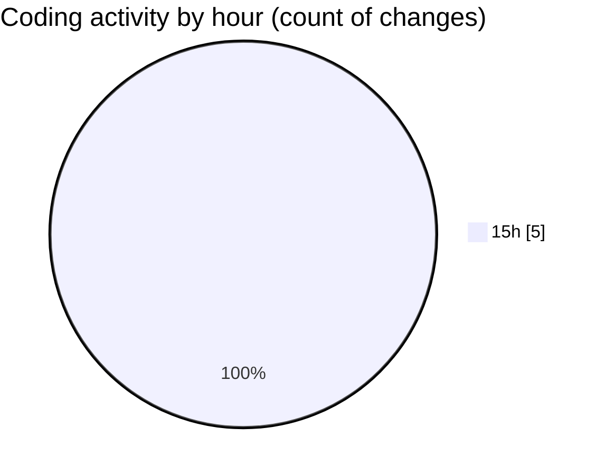

# nxtqube_webapp - Activity Summary 

## Overall Statistics

| Stat                   | Value                                                             |
| ---------------------- | ----------------------------------------------------------------- |
| **Lines Added** (➕)   | 2014                                          |
| **Lines Removed** (➖) | 0                                        |
| **Net Change** (↕)    | 2014                |
| **Active Time** (⌚)   | 3 minutes |

## Modified Files
- **Existing.jsx** (+270, -0)
- **ExistingMission.jsx** (+492, -0)
- **LaunchControl.jsx** (+623, -0)
- **calculateTime.js** (+171, -0)
- **HandleAddWaypointOnclick.js** (+458, -0)

## Visualizations

### By File Type (Lines Changed)

### By Hour (Estimated Activity Count)

> **Last Updated:** 21/11/2025, 15:16:03