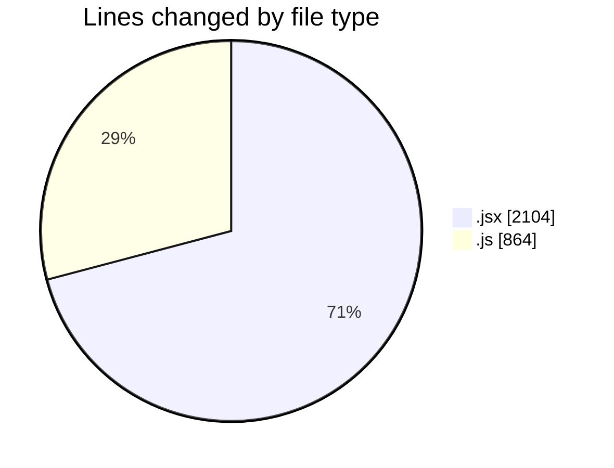
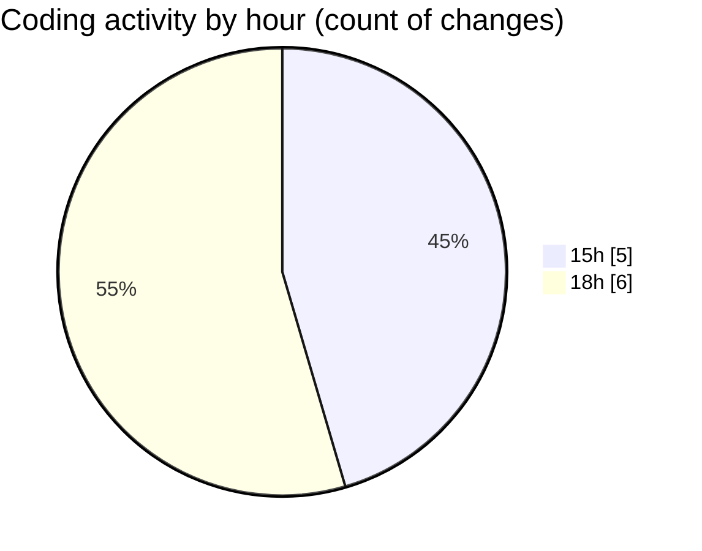

# nxtqube_webapp - Activity Summary 

## Overall Statistics

| Stat                   | Value                                                             |
| ---------------------- | ----------------------------------------------------------------- |
| **Lines Added** (➕)   | 2960                                          |
| **Lines Removed** (➖) | 8                                        |
| **Net Change** (↕)    | 2952                |
| **Active Time** (⌚)   | 8 minutes |

## Modified Files
- **Existing.jsx** (+270, -0)
- **ExistingMission.jsx** (+492, -0)
- **LaunchControl.jsx** (+623, -0)
- **calculateTime.js** (+171, -0)
- **HandleAddWaypointOnclick.js** (+458, -0)
- **mission.api.js** (+102, -0)
- **mission.reducer.js** (+35, -0)
- **mission.action.js** (+98, -0)
- **createMissionHome.jsx** (+711, -8)

## Visualizations

### By File Type (Lines Changed)

### By Hour (Estimated Activity Count)

> **Last Updated:** 21/11/2025, 18:27:15