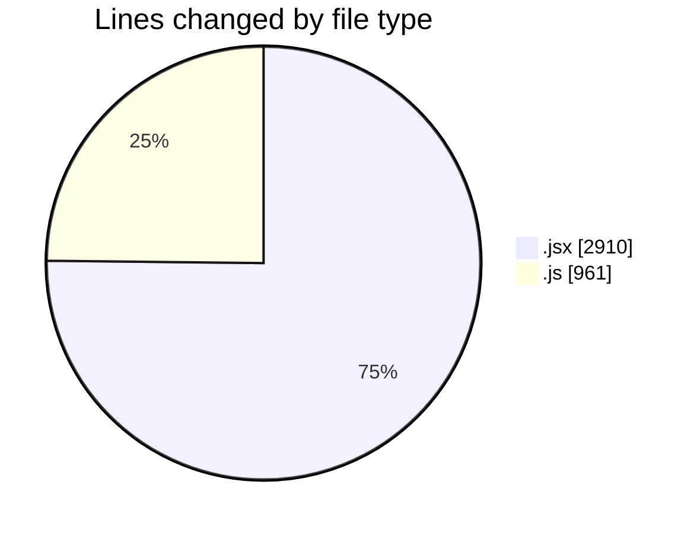
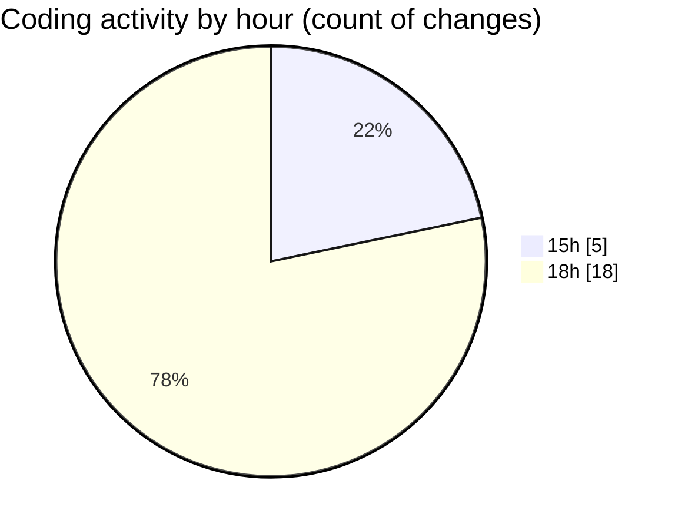

# nxtqube_webapp - Activity Summary 

## Overall Statistics

| Stat                   | Value                                                             |
| ---------------------- | ----------------------------------------------------------------- |
| **Lines Added** (➕)   | 3564                                          |
| **Lines Removed** (➖) | 307                                        |
| **Net Change** (↕)    | 3257                |
| **Active Time** (⌚)   | 40 minutes |

## Modified Files
- **Existing.jsx** (+322, -104)
- **ExistingMission.jsx** (+492, -0)
- **LaunchControl.jsx** (+623, -0)
- **calculateTime.js** (+171, -0)
- **HandleAddWaypointOnclick.js** (+458, -0)
- **mission.api.js** (+102, -0)
- **mission.reducer.js** (+35, -0)
- **mission.action.js** (+98, -0)
- **createMissionHome.jsx** (+795, -201)
- **ManageMission.jsx** (+373, -0)
- **store.js** (+95, -2)

## Visualizations

### By File Type (Lines Changed)

### By Hour (Estimated Activity Count)

> **Last Updated:** 21/11/2025, 18:37:15