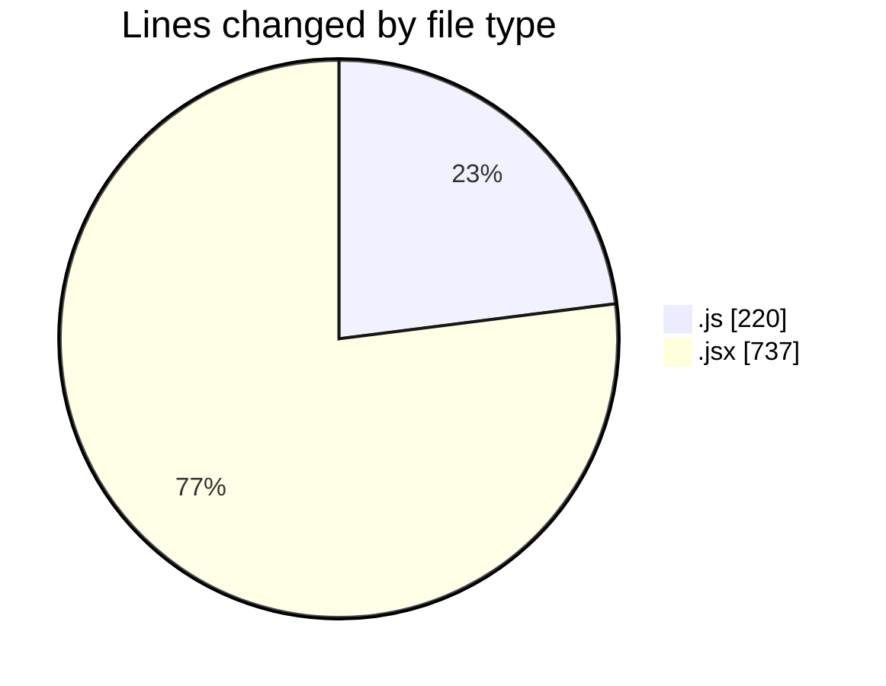

# nxtqube_webapp - Activity Summary 

## Overall Statistics

| Stat                   | Value                                                             |
| ---------------------- | ----------------------------------------------------------------- |
| **Lines Added** (➕)   | 957                                          |
| **Lines Removed** (➖) | 0                                        |
| **Net Change** (↕)    | 957                |
| **Active Time** (⌚)   | 4 minutes |

## Modified Files
- **geofence.api.js** (+92, -0)
- **geofence.reducer.js** (+27, -0)
- **geofence.action.js** (+101, -0)
- **geofence.jsx** (+298, -0)
- **ExistingFenceForm.jsx** (+439, -0)

## Visualizations

### By File Type (Lines Changed)

### By Hour (Estimated Activity Count)

> **Last Updated:** 23/11/2025, 13:31:43