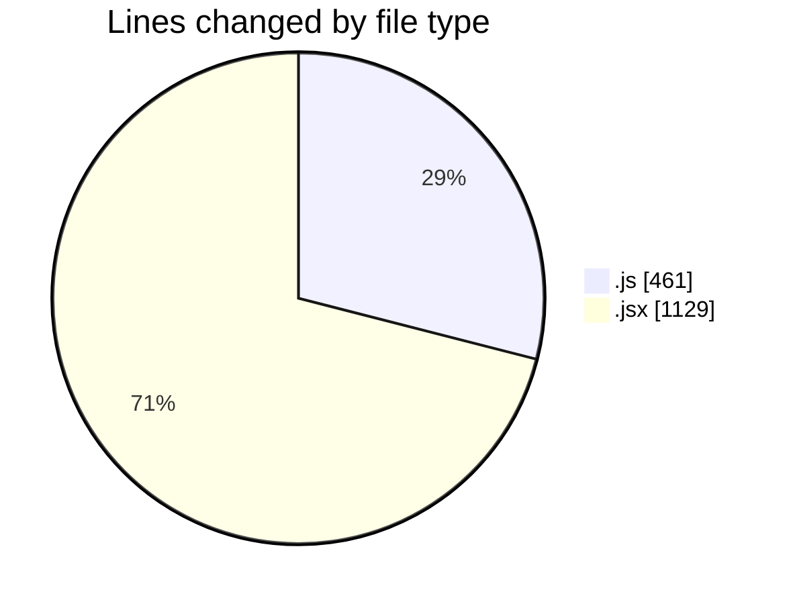
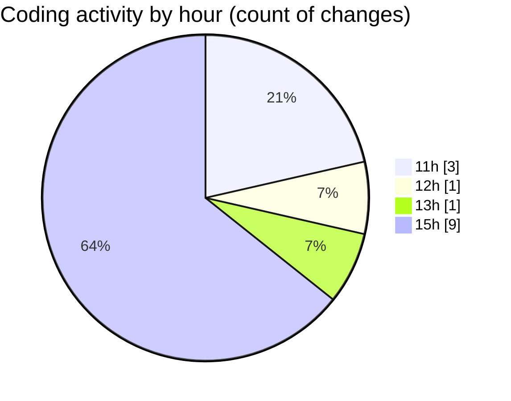

# nxtqube_webapp - Activity Summary 

## Overall Statistics

| Stat                   | Value                                                             |
| ---------------------- | ----------------------------------------------------------------- |
| **Lines Added** (➕)   | 1586                                          |
| **Lines Removed** (➖) | 4                                        |
| **Net Change** (↕)    | 1582                |
| **Active Time** (⌚)   | 24 minutes |

## Modified Files
- **3d.mission.model.js** (+49, -4)
- **mission.controller.js** (+408, -0)
- **create3DMission.jsx** (+1129, -0)

## Visualizations

### By File Type (Lines Changed)

### By Hour (Estimated Activity Count)

> **Last Updated:** 01/12/2025, 15:48:27