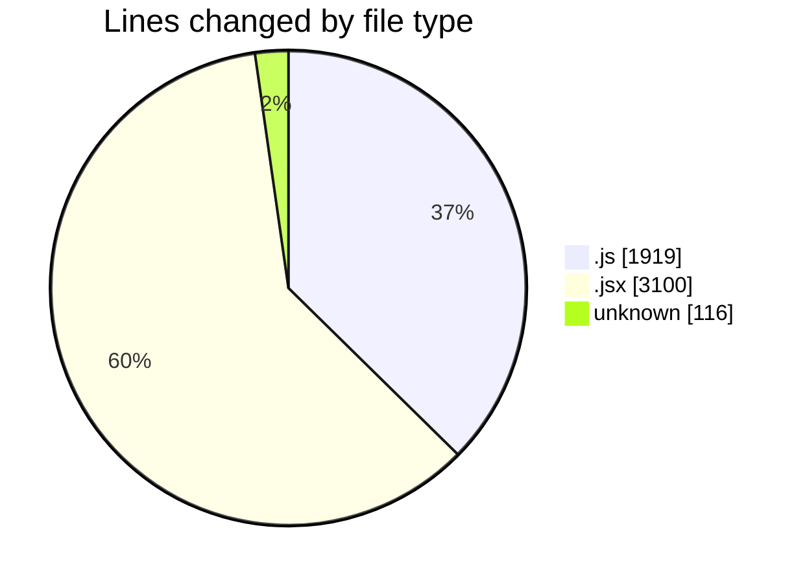
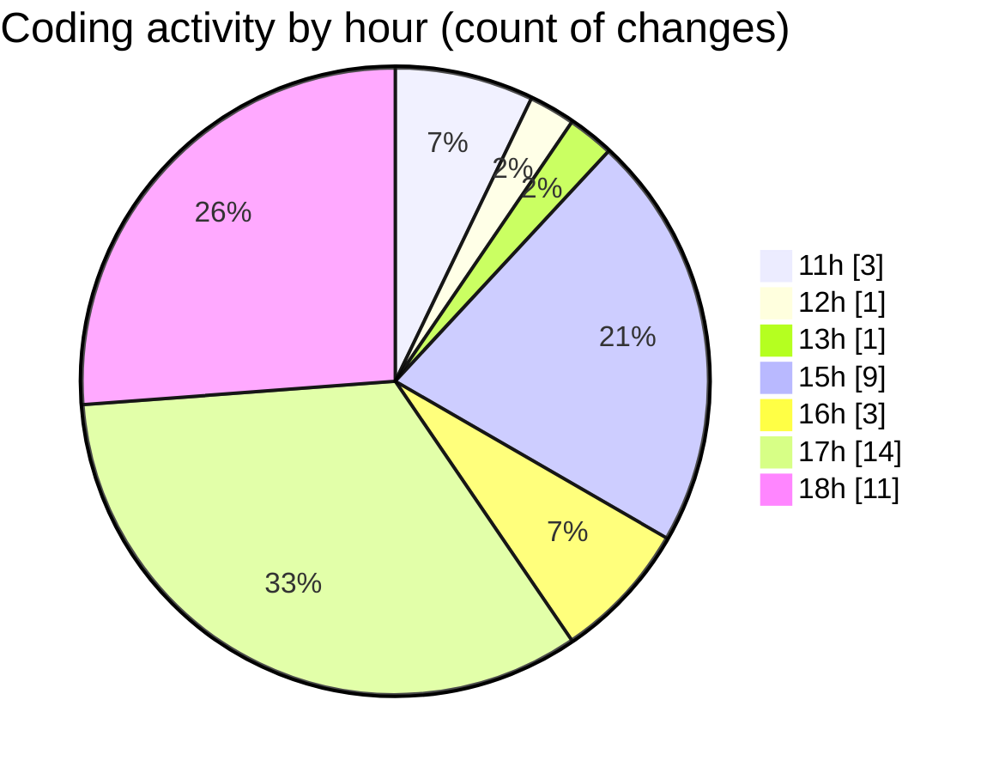

# nxtqube_webapp - Activity Summary 

## Overall Statistics

| Stat                   | Value                                                             |
| ---------------------- | ----------------------------------------------------------------- |
| **Lines Added** (➕)   | 5013                                          |
| **Lines Removed** (➖) | 122                                        |
| **Net Change** (↕)    | 4891                |
| **Active Time** (⌚)   | 62 minutes |

## Modified Files
- **3d.mission.model.js** (+96, -4)
- **mission.controller.js** (+876, -44)
- **create3DMission.jsx** (+2257, -1)
- **geofence.jsx** (+295, -0)
- **fence.data.model.js** (+73, -10)
- **fenceData.controller.js** (+576, -8)
- **www** (+116, -0)
- **routes.js** (+87, -0)
- **index.js** (+145, -0)
- **ExistingFenceForm.jsx** (+492, -55)

## Visualizations

### By File Type (Lines Changed)

### By Hour (Estimated Activity Count)

> **Last Updated:** 01/12/2025, 18:33:59