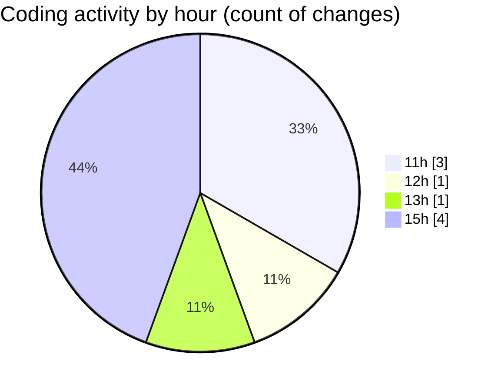

# nxtqube_webapp - Activity Summary 

## Overall Statistics

| Stat                   | Value                                                             |
| ---------------------- | ----------------------------------------------------------------- |
| **Lines Added** (➕)   | 1545                                          |
| **Lines Removed** (➖) | 4                                        |
| **Net Change** (↕)    | 1541                |
| **Active Time** (⌚)   | 9 minutes |

## Modified Files
- **3d.mission.model.js** (+49, -4)
- **mission.controller.js** (+398, -0)
- **create3DMission.jsx** (+1098, -0)

## Visualizations

### By File Type (Lines Changed)

### By Hour (Estimated Activity Count)

> **Last Updated:** 01/12/2025, 15:38:27