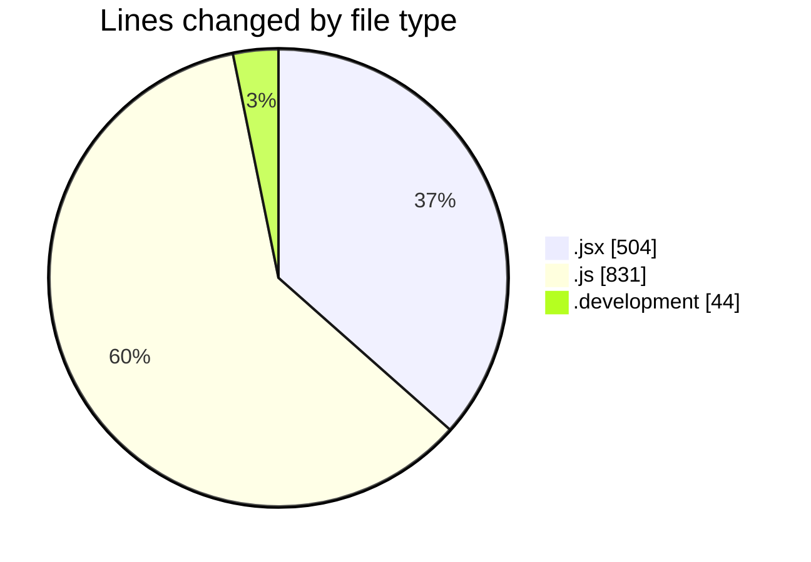
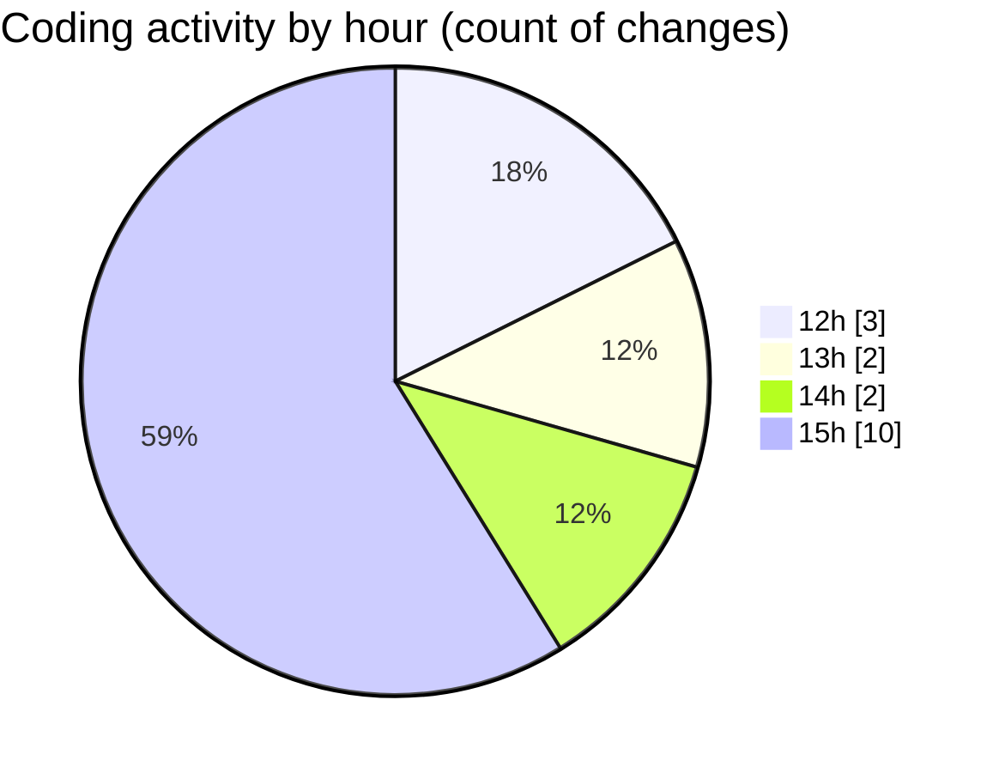

# nxtqube_webapp - Activity Summary 

## Overall Statistics

| Stat                   | Value                                                             |
| ---------------------- | ----------------------------------------------------------------- |
| **Lines Added** (➕)   | 1366                                          |
| **Lines Removed** (➖) | 13                                        |
| **Net Change** (↕)    | 1353                |
| **Active Time** (⌚)   | 8 minutes |

## Modified Files
- **ExistingMission.jsx** (+502, -2)
- **hookUtils.js** (+239, -2)
- **mission.model.js** (+59, -4)
- **geocoding.js** (+79, -5)
- **mission.controller.js** (+443, -0)
- **.env.development** (+44, -0)

## Visualizations

### By File Type (Lines Changed)

### By Hour (Estimated Activity Count)

> **Last Updated:** 02/12/2025, 16:01:55