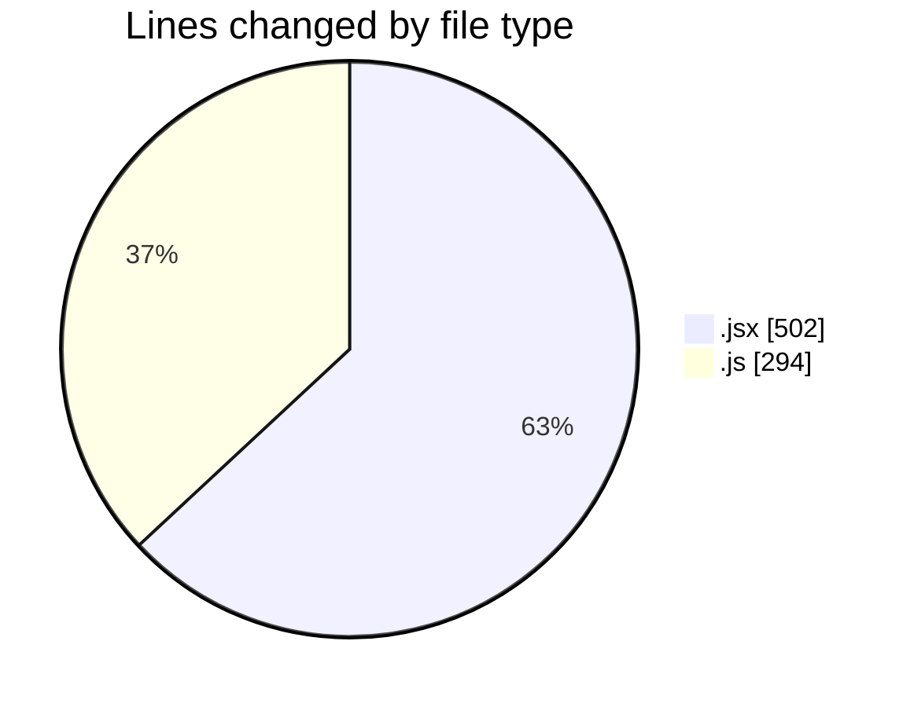
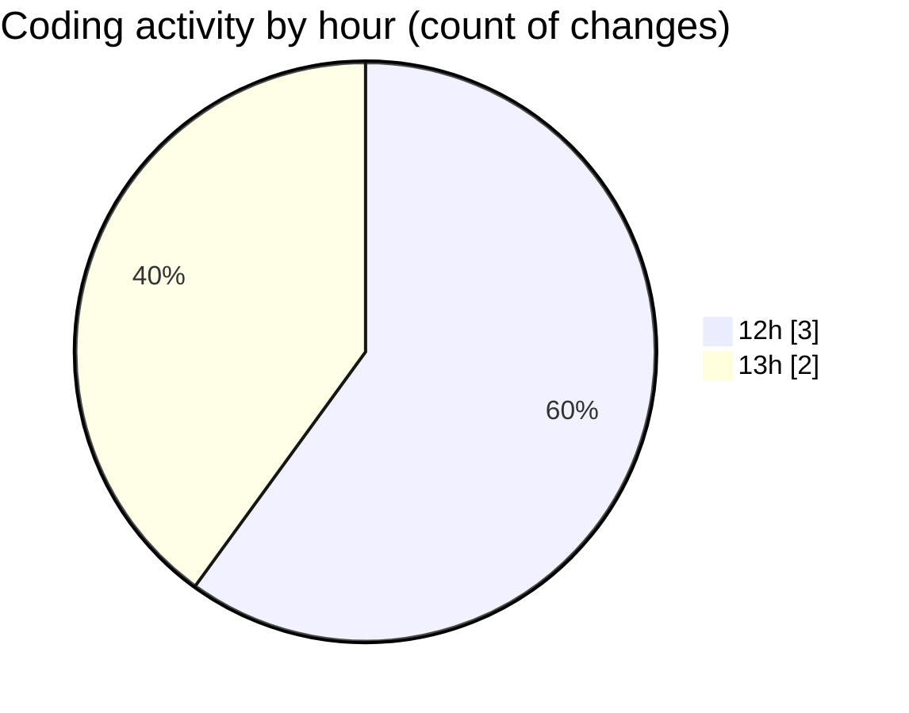

# nxtqube_webapp - Activity Summary 

## Overall Statistics

| Stat                   | Value                                                             |
| ---------------------- | ----------------------------------------------------------------- |
| **Lines Added** (➕)   | 794                                          |
| **Lines Removed** (➖) | 2                                        |
| **Net Change** (↕)    | 792                |
| **Active Time** (⌚)   | 4 minutes |

## Modified Files
- **ExistingMission.jsx** (+501, -1)
- **hookUtils.js** (+238, -1)
- **mission.model.js** (+55, -0)

## Visualizations

### By File Type (Lines Changed)

### By Hour (Estimated Activity Count)

> **Last Updated:** 02/12/2025, 13:50:35