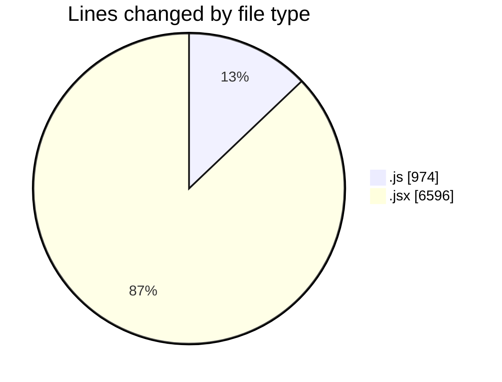
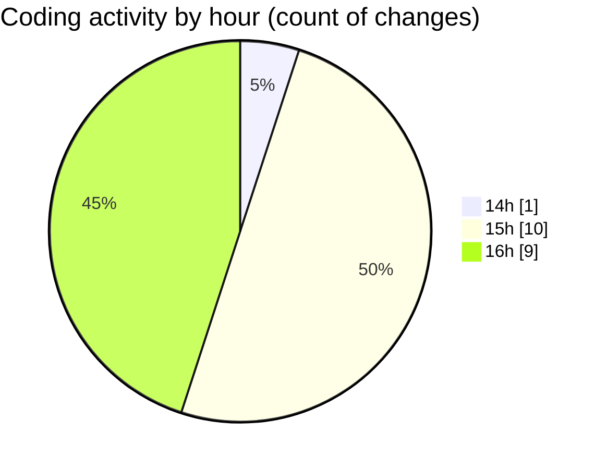

# nxtqube_webapp - Activity Summary 

## Overall Statistics

| Stat                   | Value                                                             |
| ---------------------- | ----------------------------------------------------------------- |
| **Lines Added** (➕)   | 7526                                          |
| **Lines Removed** (➖) | 44                                        |
| **Net Change** (↕)    | 7482                |
| **Active Time** (⌚)   | 15 minutes |

## Modified Files
- **useMissionDisplay.js** (+974, -0)
- **Map.jsx** (+1539, -16)
- **MissionControl.jsx** (+1204, -28)
- **createPathMission.jsx** (+107, -0)
- **gridUI.jsx** (+956, -0)
- **createGridMission.jsx** (+2090, -0)
- **LaunchControl.jsx** (+656, -0)

## Visualizations

### By File Type (Lines Changed)

### By Hour (Estimated Activity Count)

> **Last Updated:** 05/12/2025, 16:49:36