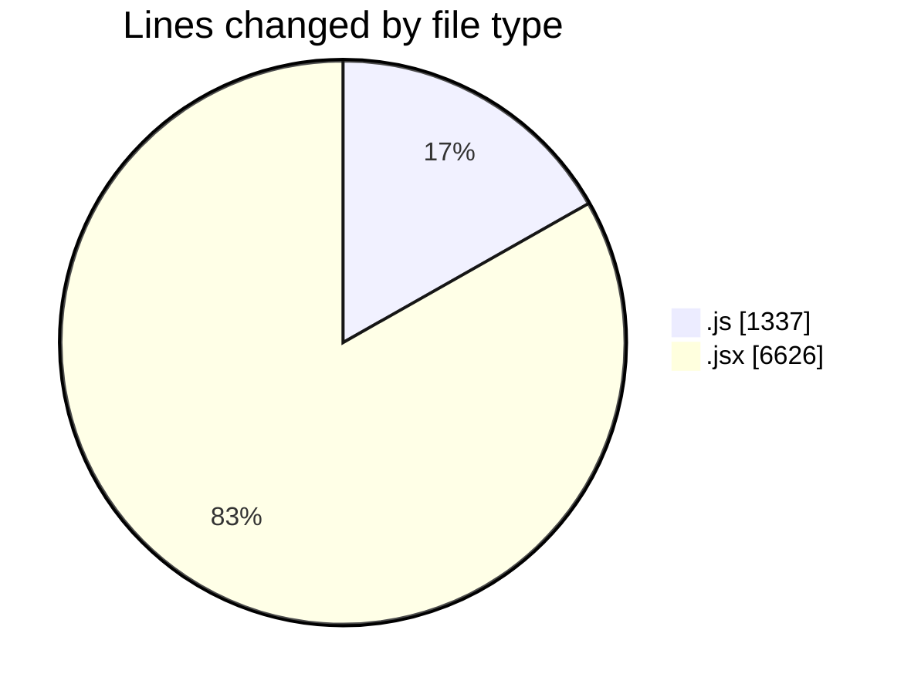
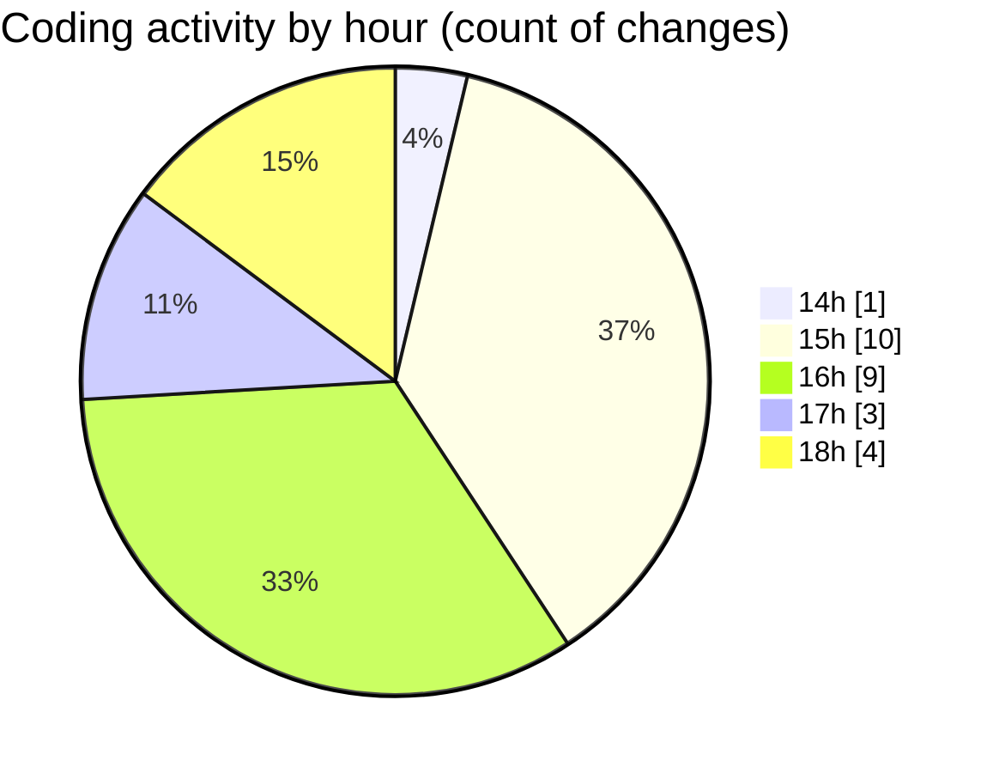

# nxtqube_webapp - Activity Summary 

## Overall Statistics

| Stat                   | Value                                                             |
| ---------------------- | ----------------------------------------------------------------- |
| **Lines Added** (➕)   | 7919                                          |
| **Lines Removed** (➖) | 44                                        |
| **Net Change** (↕)    | 7875                |
| **Active Time** (⌚)   | 17 minutes |

## Modified Files
- **useMissionDisplay.js** (+974, -0)
- **Map.jsx** (+1557, -16)
- **MissionControl.jsx** (+1204, -28)
- **createPathMission.jsx** (+107, -0)
- **gridUI.jsx** (+956, -0)
- **createGridMission.jsx** (+2090, -0)
- **LaunchControl.jsx** (+668, -0)
- **dataProcessor.js** (+363, -0)

## Visualizations

### By File Type (Lines Changed)

### By Hour (Estimated Activity Count)

> **Last Updated:** 05/12/2025, 18:40:51