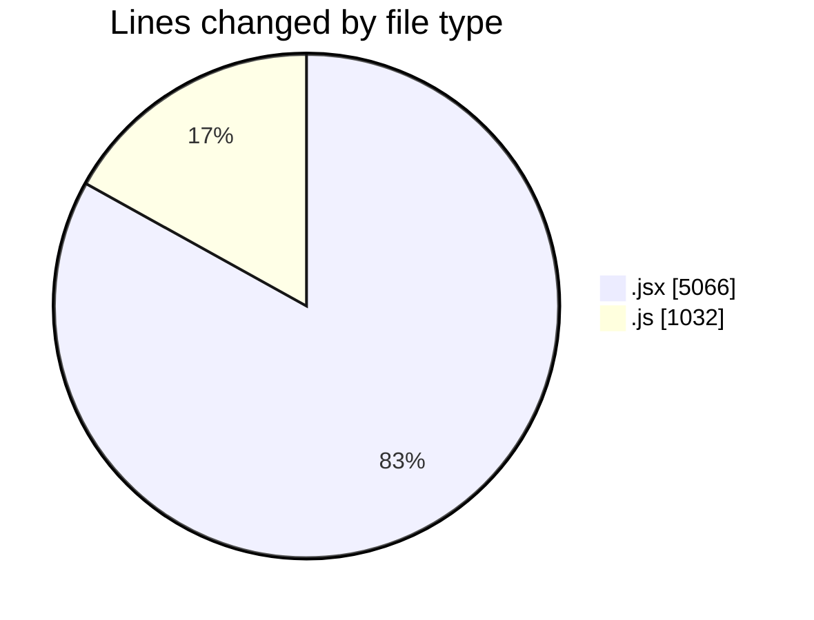
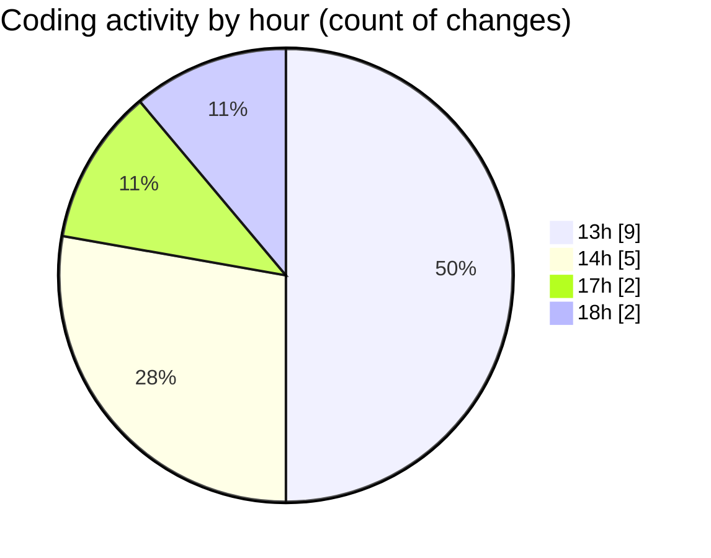

# nxtqube_webapp - Activity Summary 

## Overall Statistics

| Stat                   | Value                                                             |
| ---------------------- | ----------------------------------------------------------------- |
| **Lines Added** (➕)   | 6069                                          |
| **Lines Removed** (➖) | 29                                        |
| **Net Change** (↕)    | 6040                |
| **Active Time** (⌚)   | 20 minutes |

## Modified Files
- **create3DMission.jsx** (+1140, -12)
- **createGridMission.jsx** (+2357, -9)
- **useMissionDisplay.js** (+1024, -8)
- **Map.jsx** (+1548, -0)

## Visualizations

### By File Type (Lines Changed)

### By Hour (Estimated Activity Count)

> **Last Updated:** 07/12/2025, 18:16:12