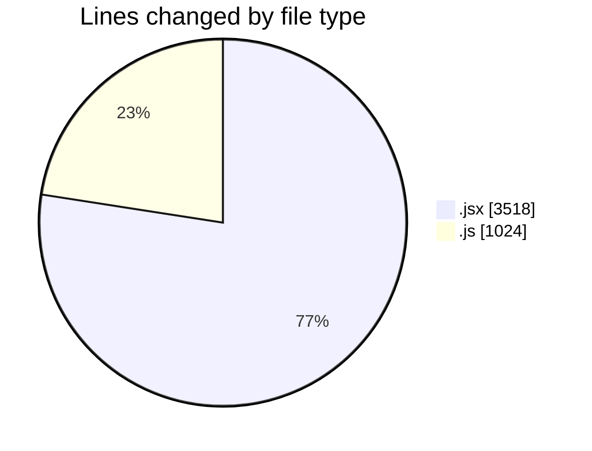
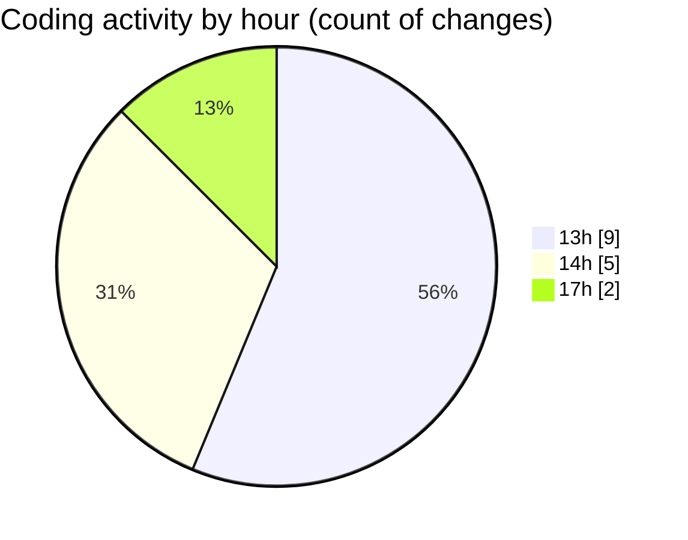

# nxtqube_webapp - Activity Summary 

## Overall Statistics

| Stat                   | Value                                                             |
| ---------------------- | ----------------------------------------------------------------- |
| **Lines Added** (➕)   | 4513                                          |
| **Lines Removed** (➖) | 29                                        |
| **Net Change** (↕)    | 4484                |
| **Active Time** (⌚)   | 15 minutes |

## Modified Files
- **create3DMission.jsx** (+1140, -12)
- **createGridMission.jsx** (+2357, -9)
- **useMissionDisplay.js** (+1016, -8)

## Visualizations

### By File Type (Lines Changed)

### By Hour (Estimated Activity Count)

> **Last Updated:** 07/12/2025, 17:44:17