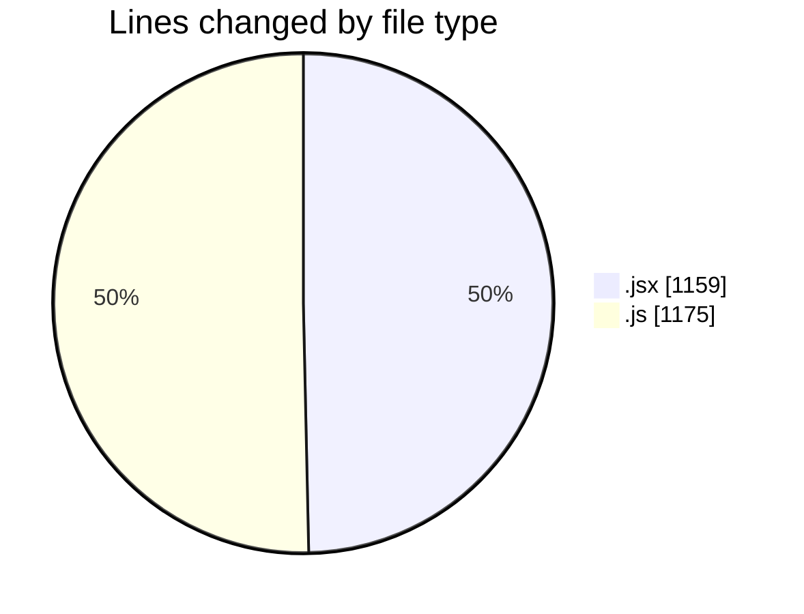
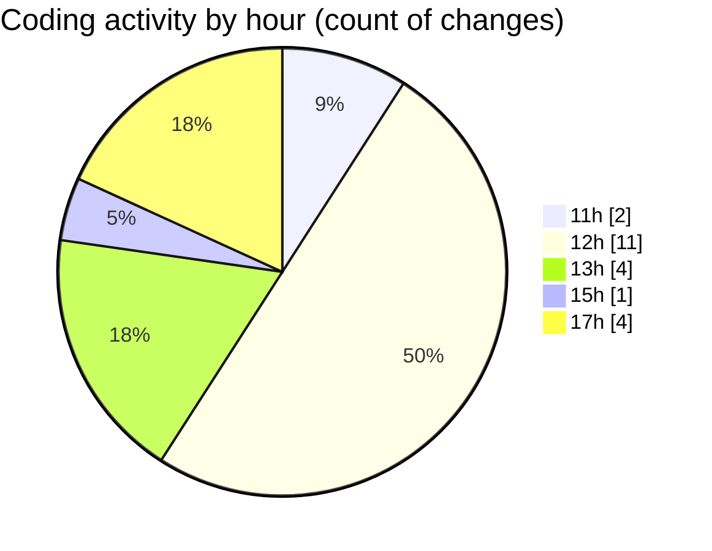

# nxtqube_webapp - Activity Summary 

## Overall Statistics

| Stat                   | Value                                                             |
| ---------------------- | ----------------------------------------------------------------- |
| **Lines Added** (➕)   | 2071                                          |
| **Lines Removed** (➖) | 263                                        |
| **Net Change** (↕)    | 1808                |
| **Active Time** (⌚)   | 19 minutes |

## Modified Files
- **LaunchControl.jsx** (+668, -0)
- **createGridMission.jsx** (+88, -54)
- **Map.jsx** (+170, -179)
- **gridMissionUtils.js** (+1123, -0)
- **useMissionDisplay.js** (+22, -30)

## Visualizations

### By File Type (Lines Changed)

### By Hour (Estimated Activity Count)

> **Last Updated:** 08/12/2025, 17:22:21