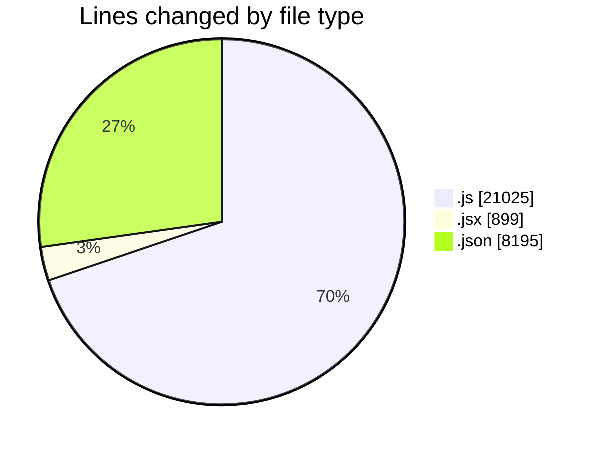
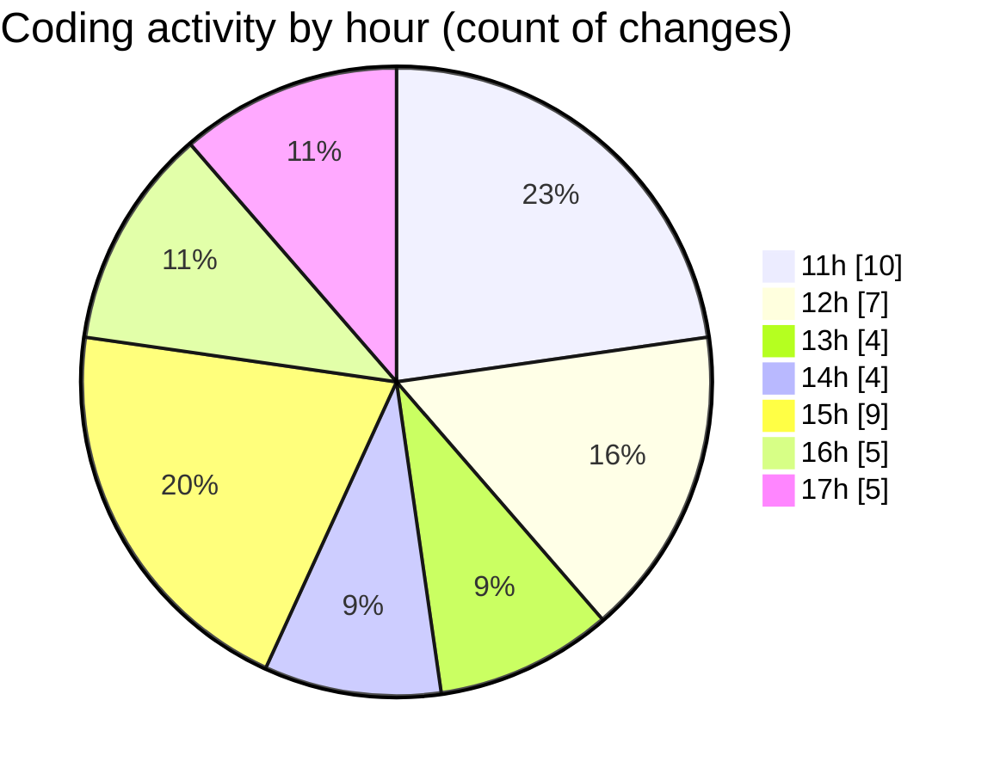

# nxtqube_webapp - Activity Summary 

## Overall Statistics

| Stat                   | Value                                                             |
| ---------------------- | ----------------------------------------------------------------- |
| **Lines Added** (➕)   | 21151                                          |
| **Lines Removed** (➖) | 8968                                        |
| **Net Change** (↕)    | 12183                |
| **Active Time** (⌚)   | 51 minutes |

## Modified Files
- **drawGrid.js** (+11888, -8616)
- **Map.jsx** (+0, -164)
- **useMissionDisplay.js** (+0, -135)
- **package-lock.json** (+8195, -0)
- **Gallerypage.jsx** (+693, -42)
- **dataProcessor.js** (+375, -11)

## Visualizations

### By File Type (Lines Changed)

### By Hour (Estimated Activity Count)

> **Last Updated:** 09/12/2025, 17:45:01