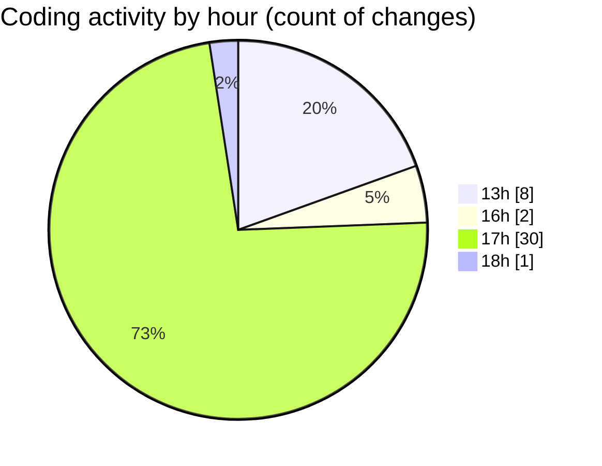

# nxtqube_webapp - Activity Summary 

## Overall Statistics

| Stat                   | Value                                                             |
| ---------------------- | ----------------------------------------------------------------- |
| **Lines Added** (➕)   | 7016                                          |
| **Lines Removed** (➖) | 4951                                        |
| **Net Change** (↕)    | 2065                |
| **Active Time** (⌚)   | 59 minutes |

## Modified Files
- **drawGrid.js** (+2685, -4926)
- **createGridMission.jsx** (+2408, -25)
- **ManageMission.jsx** (+373, -0)
- **Map.jsx** (+1550, -0)

## Visualizations

### By File Type (Lines Changed)

### By Hour (Estimated Activity Count)

> **Last Updated:** 10/12/2025, 18:22:25