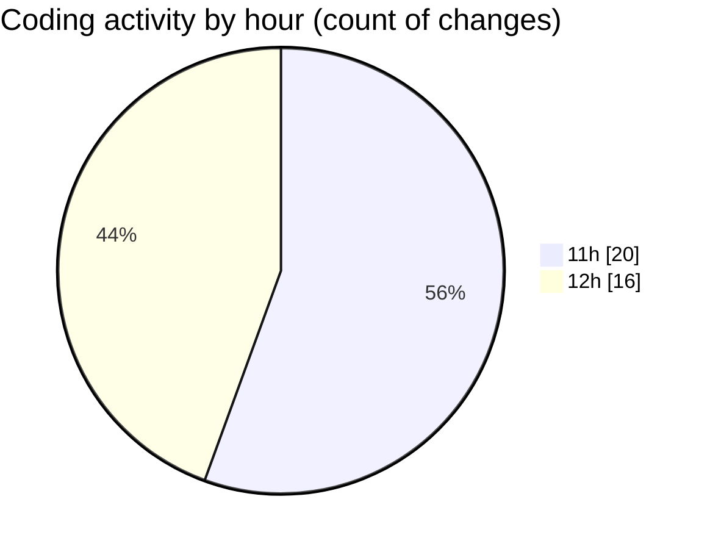

# nxtqube_webapp - Activity Summary 

## Overall Statistics

| Stat                   | Value                                                             |
| ---------------------- | ----------------------------------------------------------------- |
| **Lines Added** (➕)   | 5517                                          |
| **Lines Removed** (➖) | 318                                        |
| **Net Change** (↕)    | 5199                |
| **Active Time** (⌚)   | 30 minutes |

## Modified Files
- **createGridMission.jsx** (+2364, -0)
- **useCesiumViewer.js** (+208, -60)
- **constants.js** (+74, -7)
- **use.cesium.map.jsx** (+243, -26)
- **cesium.provider.jsx** (+399, -22)
- **Map.jsx** (+1563, -174)
- **GalleryMission.jsx** (+141, -0)
- **ImageList.jsx** (+318, -19)
- **ImagePopup.jsx** (+195, -0)
- **Analytics.jsx** (+12, -10)

## Visualizations

### By File Type (Lines Changed)

### By Hour (Estimated Activity Count)

> **Last Updated:** 11/12/2025, 12:48:51