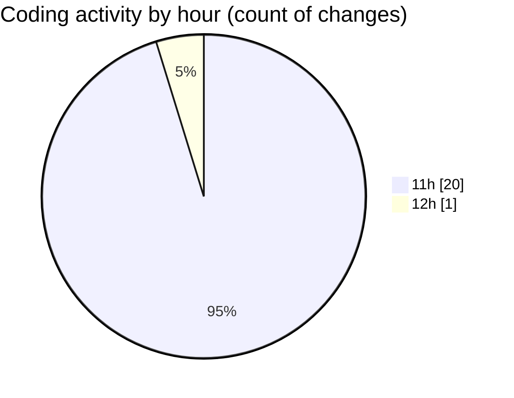

# nxtqube_webapp - Activity Summary 

## Overall Statistics

| Stat                   | Value                                                             |
| ---------------------- | ----------------------------------------------------------------- |
| **Lines Added** (➕)   | 4798                                          |
| **Lines Removed** (➖) | 112                                        |
| **Net Change** (↕)    | 4686                |
| **Active Time** (⌚)   | 18 minutes |

## Modified Files
- **createGridMission.jsx** (+2364, -0)
- **useCesiumViewer.js** (+179, -60)
- **constants.js** (+74, -7)
- **use.cesium.map.jsx** (+230, -13)
- **cesium.provider.jsx** (+388, -11)
- **Map.jsx** (+1563, -21)

## Visualizations

### By File Type (Lines Changed)

### By Hour (Estimated Activity Count)

> **Last Updated:** 11/12/2025, 12:00:19