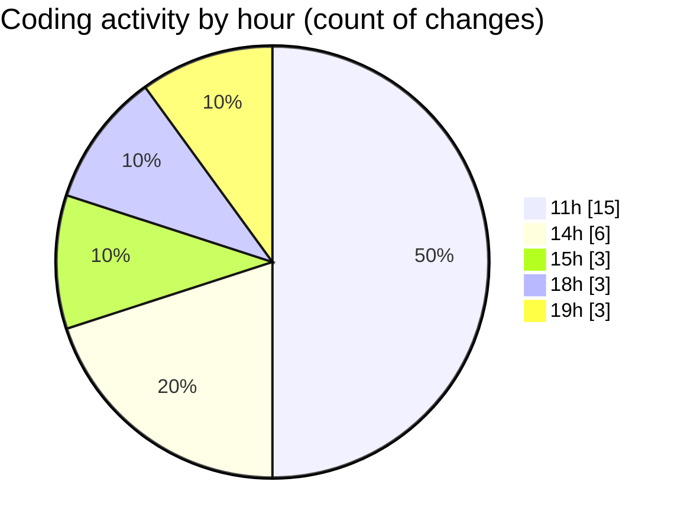

# nxtqube_webapp - Activity Summary 

## Overall Statistics

| Stat                   | Value                                                             |
| ---------------------- | ----------------------------------------------------------------- |
| **Lines Added** (➕)   | 4191                                          |
| **Lines Removed** (➖) | 98                                        |
| **Net Change** (↕)    | 4093                |
| **Active Time** (⌚)   | 30 minutes |

## Modified Files
- **useFenceManagement.js** (+2327, -17)
- **drawGrid.js** (+1387, -61)
- **routes.js** (+87, -0)
- **launch.mission.controller.js** (+113, -20)
- **Analytics.jsx** (+277, -0)

## Visualizations

### By File Type (Lines Changed)

### By Hour (Estimated Activity Count)

> **Last Updated:** 12/12/2025, 19:20:42