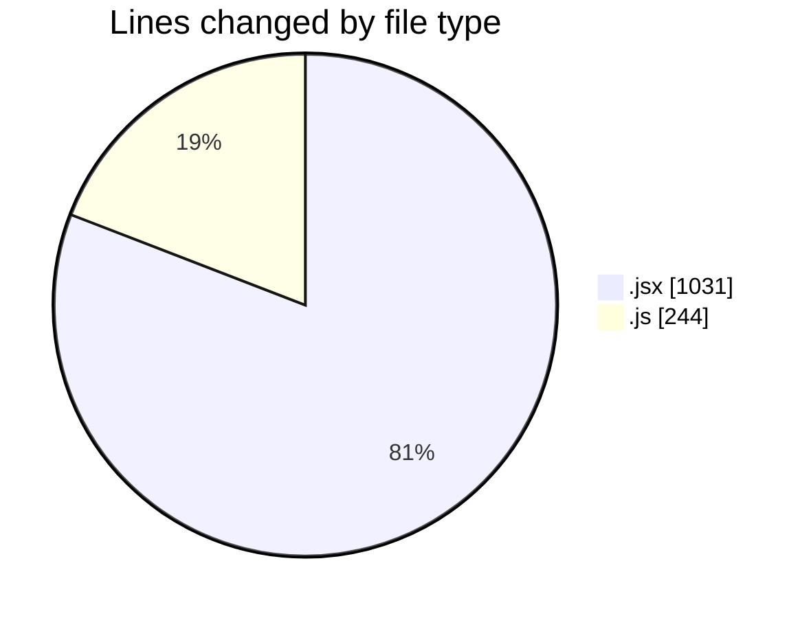
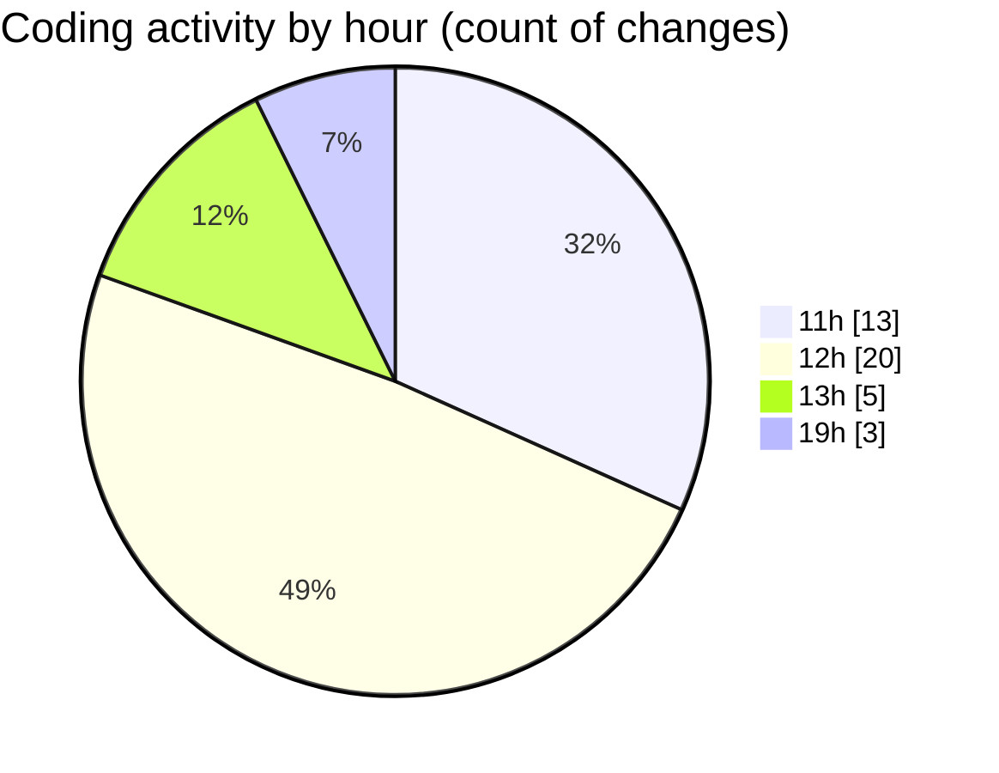

# nxtqube_webapp - Activity Summary 

## Overall Statistics

| Stat                   | Value                                                             |
| ---------------------- | ----------------------------------------------------------------- |
| **Lines Added** (➕)   | 1060                                          |
| **Lines Removed** (➖) | 215                                        |
| **Net Change** (↕)    | 845                |
| **Active Time** (⌚)   | 64 minutes |

## Modified Files
- **Analytics.jsx** (+605, -196)
- **launch.mission.controller.js** (+18, -3)
- **site.controller.js** (+207, -16)
- **FetchHomeLocation.jsx** (+230, -0)

## Visualizations

### By File Type (Lines Changed)

### By Hour (Estimated Activity Count)

> **Last Updated:** 14/12/2025, 13:45:10