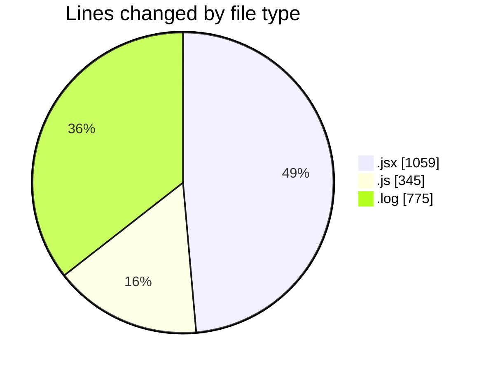
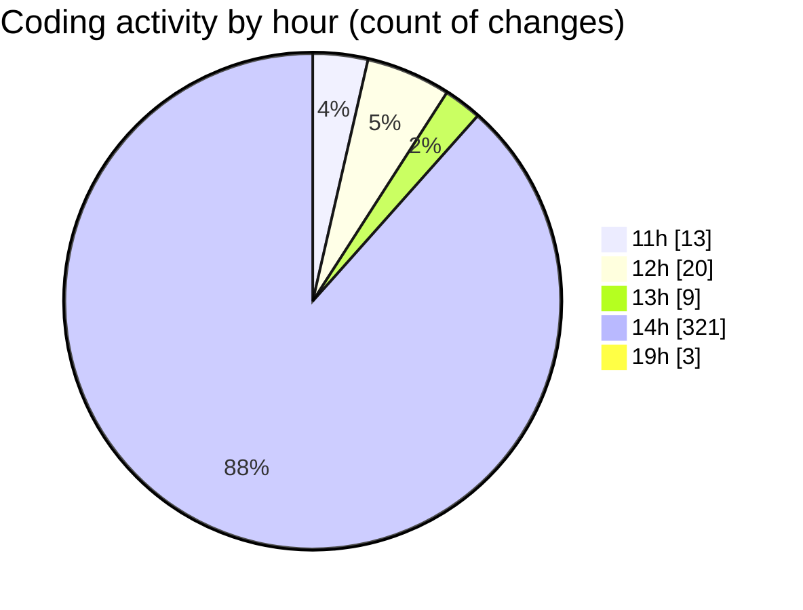

# nxtqube_webapp - Activity Summary 

## Overall Statistics

| Stat                   | Value                                                             |
| ---------------------- | ----------------------------------------------------------------- |
| **Lines Added** (➕)   | 1917                                          |
| **Lines Removed** (➖) | 262                                        |
| **Net Change** (↕)    | 1655                |
| **Active Time** (⌚)   | 392 minutes |

## Modified Files
- **Analytics.jsx** (+605, -196)
- **launch.mission.controller.js** (+18, -3)
- **site.controller.js** (+207, -16)
- **FetchHomeLocation.jsx** (+230, -28)
- **droneCommand.controller.js** (+82, -19)
- **1_session_2025-12-14_14-48-25.log** (+775, -0)

## Visualizations

### By File Type (Lines Changed)

### By Hour (Estimated Activity Count)

> **Last Updated:** 14/12/2025, 14:54:36