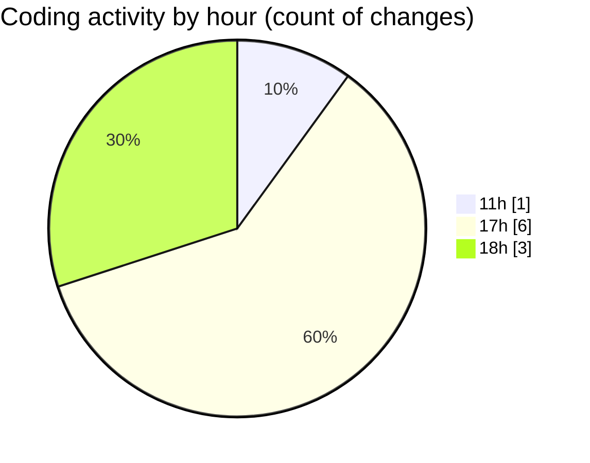

# nxtqube_webapp - Activity Summary 

## Overall Statistics

| Stat                   | Value                                                             |
| ---------------------- | ----------------------------------------------------------------- |
| **Lines Added** (➕)   | 10295                                          |
| **Lines Removed** (➖) | 32                                        |
| **Net Change** (↕)    | 10263                |
| **Active Time** (⌚)   | 8 minutes |

## Modified Files
- **ExistingMission.jsx** (+524, -0)
- **package-lock.json** (+8195, -0)
- **constants.js** (+72, -0)
- **Map.jsx** (+1504, -32)

## Visualizations

### By File Type (Lines Changed)

### By Hour (Estimated Activity Count)

> **Last Updated:** 23/12/2025, 18:28:38