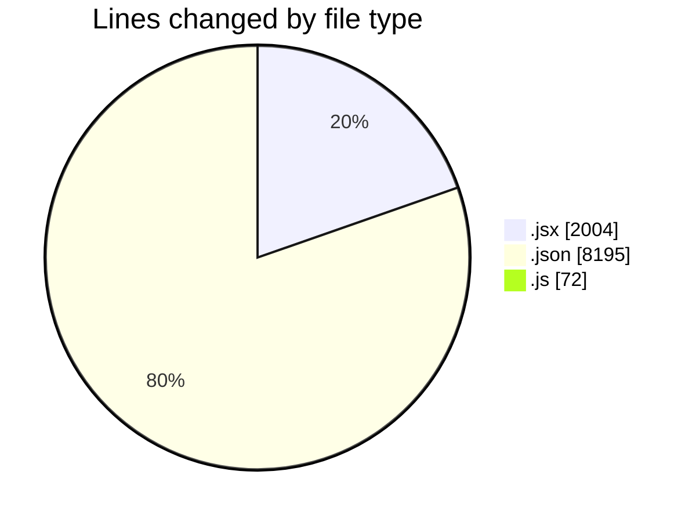
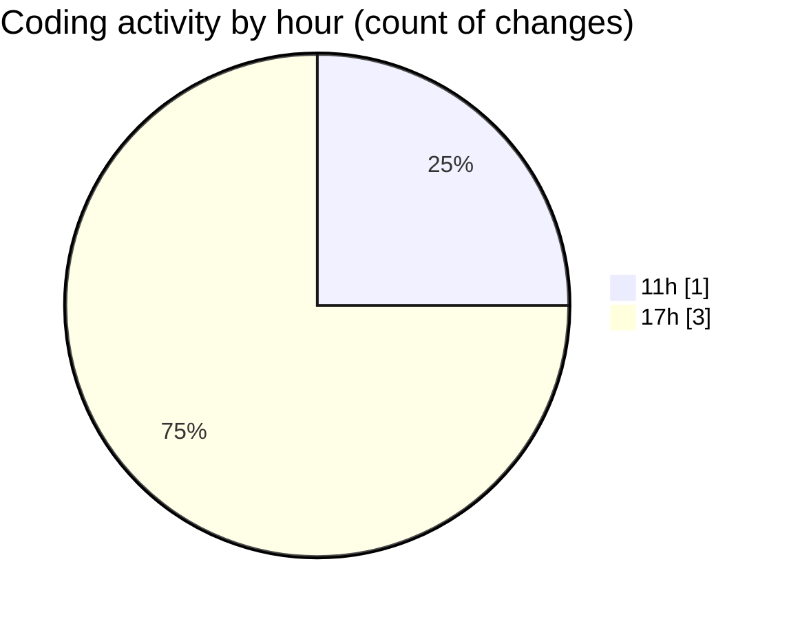

# nxtqube_webapp - Activity Summary 

## Overall Statistics

| Stat                   | Value                                                             |
| ---------------------- | ----------------------------------------------------------------- |
| **Lines Added** (➕)   | 10271                                          |
| **Lines Removed** (➖) | 0                                        |
| **Net Change** (↕)    | 10271                |
| **Active Time** (⌚)   | 4 minutes |

## Modified Files
- **ExistingMission.jsx** (+524, -0)
- **package-lock.json** (+8195, -0)
- **constants.js** (+72, -0)
- **Map.jsx** (+1480, -0)

## Visualizations

### By File Type (Lines Changed)

### By Hour (Estimated Activity Count)

> **Last Updated:** 23/12/2025, 17:15:34