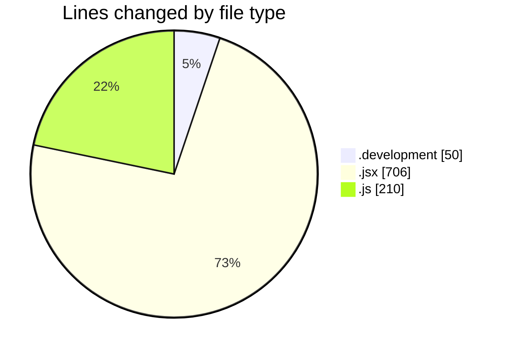
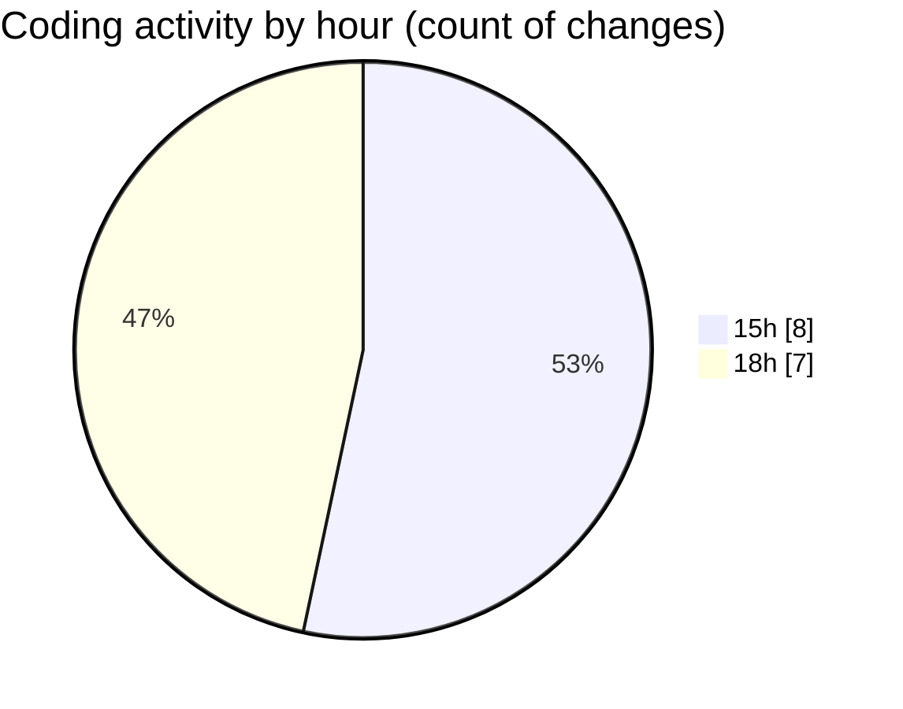

# nxtqube_webapp - Activity Summary 

## Overall Statistics

| Stat                   | Value                                                             |
| ---------------------- | ----------------------------------------------------------------- |
| **Lines Added** (➕)   | 960                                          |
| **Lines Removed** (➖) | 6                                        |
| **Net Change** (↕)    | 954                |
| **Active Time** (⌚)   | 14 minutes |

## Modified Files
- **.env.development** (+49, -1)
- **LaunchControl.jsx** (+706, -0)
- **droneCommand.controller.js** (+185, -5)
- **droneCommand.route.js** (+20, -0)

## Visualizations

### By File Type (Lines Changed)

### By Hour (Estimated Activity Count)

> **Last Updated:** 25/12/2025, 18:59:23