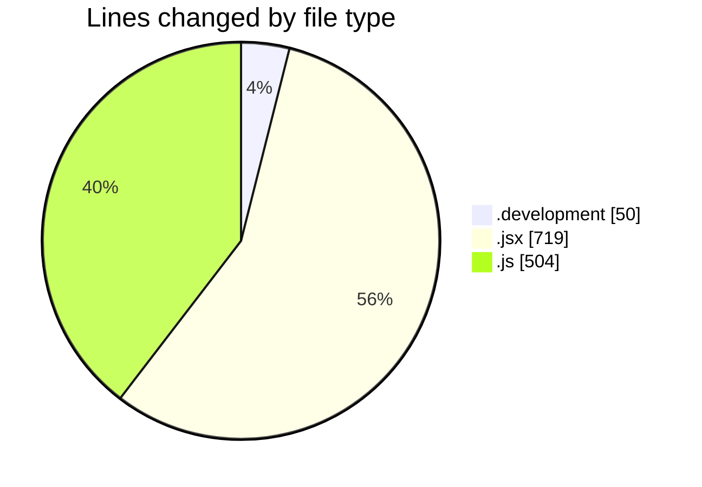
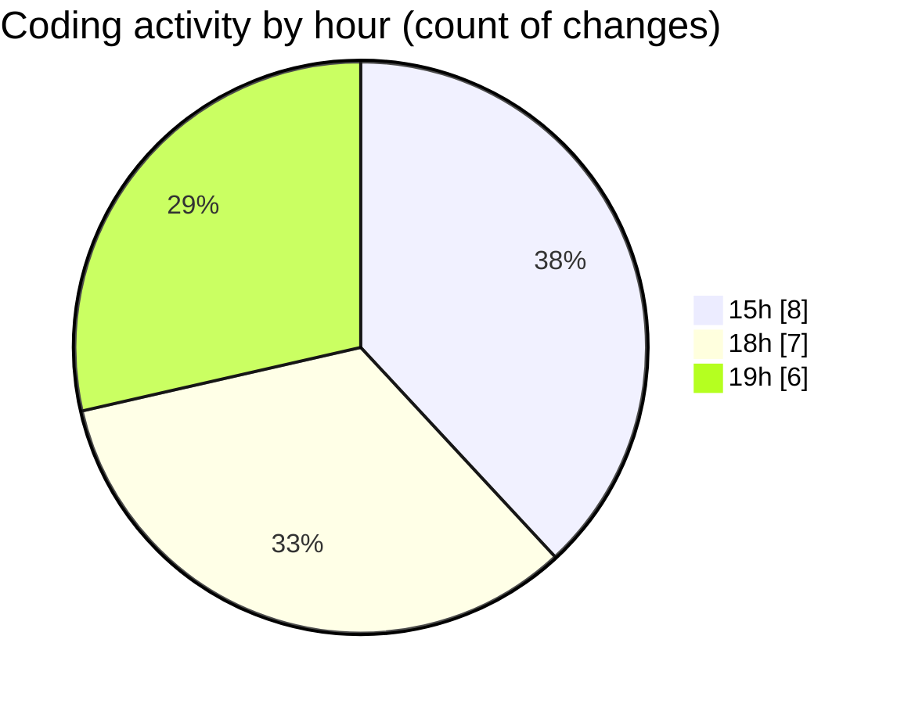

# nxtqube_webapp - Activity Summary 

## Overall Statistics

| Stat                   | Value                                                             |
| ---------------------- | ----------------------------------------------------------------- |
| **Lines Added** (➕)   | 1261                                          |
| **Lines Removed** (➖) | 12                                        |
| **Net Change** (↕)    | 1249                |
| **Active Time** (⌚)   | 25 minutes |

## Modified Files
- **.env.development** (+49, -1)
- **LaunchControl.jsx** (+719, -0)
- **droneCommand.controller.js** (+187, -5)
- **droneCommand.route.js** (+20, -6)
- **launch.manager.js** (+151, -0)
- **drone.command.validator.js** (+26, -0)
- **routes.js** (+109, -0)

## Visualizations

### By File Type (Lines Changed)

### By Hour (Estimated Activity Count)

> **Last Updated:** 25/12/2025, 19:14:23