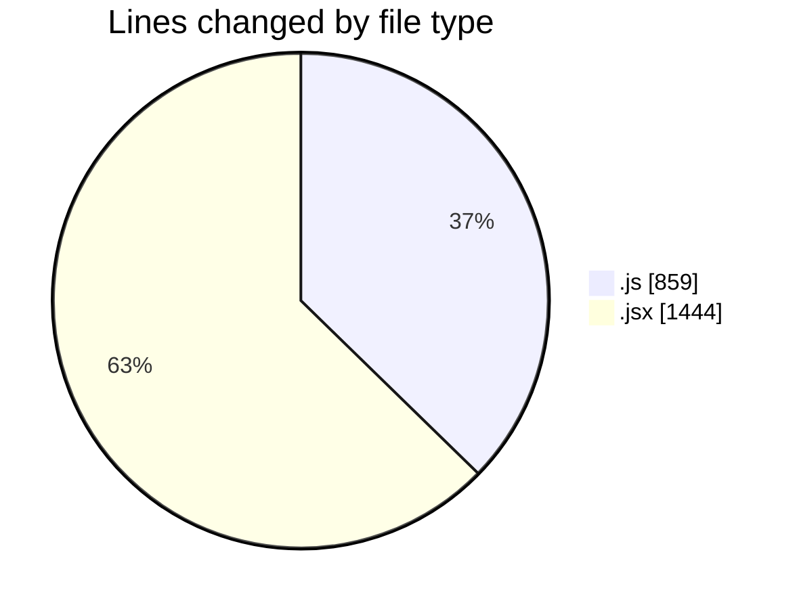
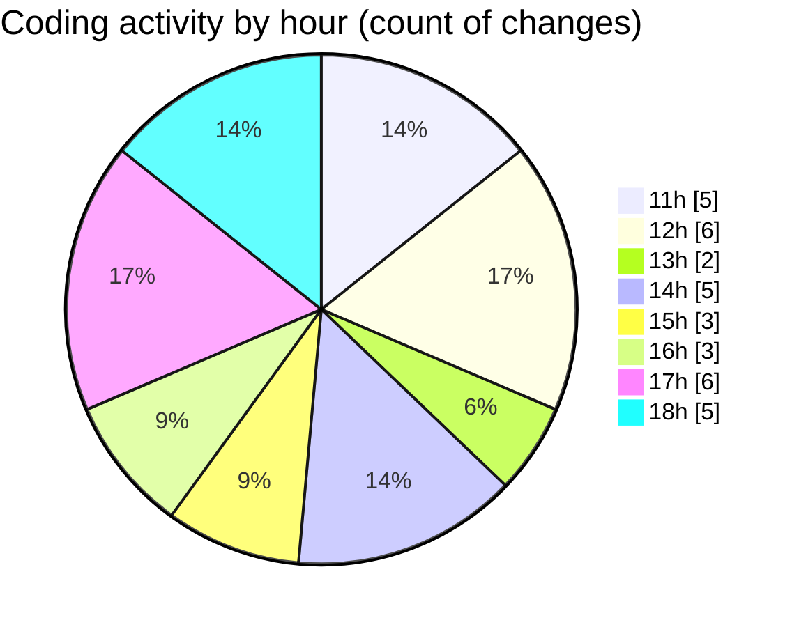

# nxtqube_webapp - Activity Summary 

## Overall Statistics

| Stat                   | Value                                                             |
| ---------------------- | ----------------------------------------------------------------- |
| **Lines Added** (➕)   | 2223                                          |
| **Lines Removed** (➖) | 80                                        |
| **Net Change** (↕)    | 2143                |
| **Active Time** (⌚)   | 46 minutes |

## Modified Files
- **droneCommand.controller.js** (+183, -55)
- **mission3d.launch.manager.js** (+64, -0)
- **3d.mission.model.js** (+71, -14)
- **create3DMission.jsx** (+1433, -11)
- **mission.controller.js** (+472, -0)

## Visualizations

### By File Type (Lines Changed)

### By Hour (Estimated Activity Count)

> **Last Updated:** 26/12/2025, 18:56:51