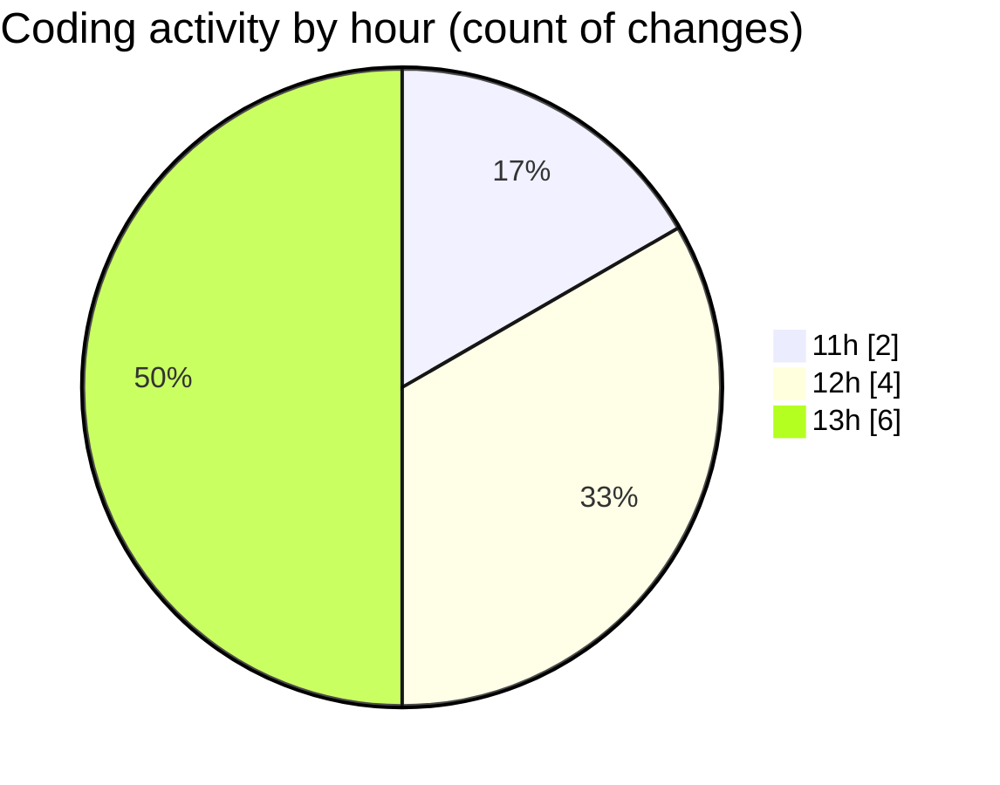

# nxtqube_webapp - Activity Summary 

## Overall Statistics

| Stat                   | Value                                                             |
| ---------------------- | ----------------------------------------------------------------- |
| **Lines Added** (➕)   | 2856                                          |
| **Lines Removed** (➖) | 0                                        |
| **Net Change** (↕)    | 2856                |
| **Active Time** (⌚)   | 8 minutes |

## Modified Files
- **create3DMission.jsx** (+1340, -0)
- **mission3d.service.js** (+298, -0)
- **LaunchControl.jsx** (+719, -0)
- **dataProcessor.js** (+376, -0)
- **commonds.json** (+123, -0)

## Visualizations

### By File Type (Lines Changed)

### By Hour (Estimated Activity Count)

> **Last Updated:** 28/12/2025, 13:09:34