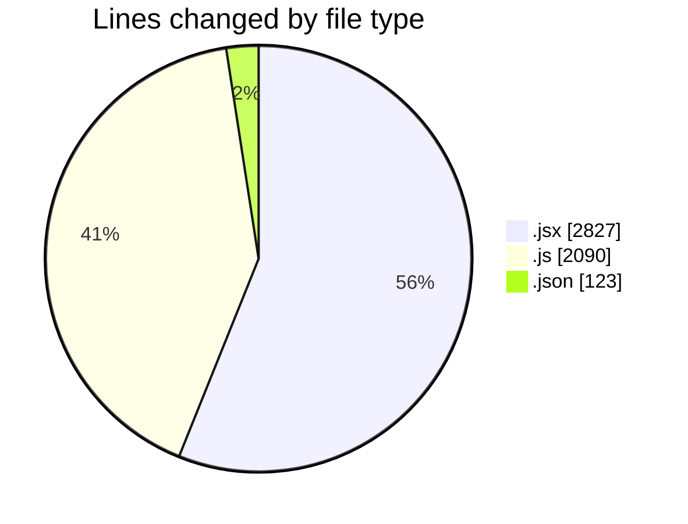
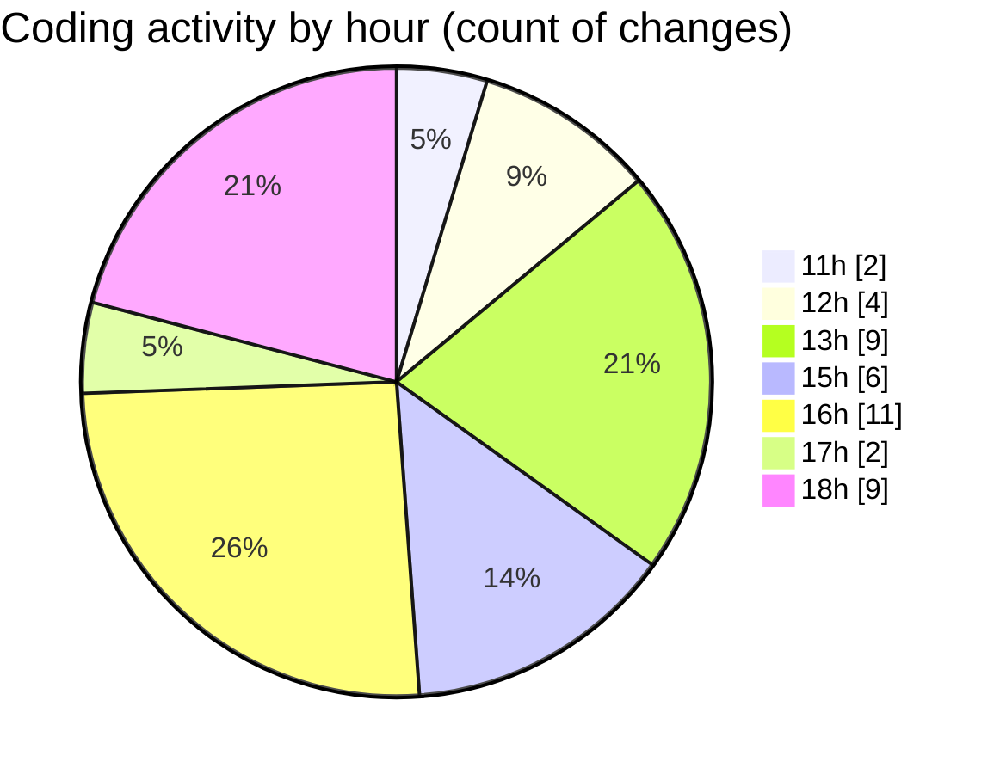

# nxtqube_webapp - Activity Summary 

## Overall Statistics

| Stat                   | Value                                                             |
| ---------------------- | ----------------------------------------------------------------- |
| **Lines Added** (➕)   | 4676                                          |
| **Lines Removed** (➖) | 364                                        |
| **Net Change** (↕)    | 4312                |
| **Active Time** (⌚)   | 43 minutes |

## Modified Files
- **create3DMission.jsx** (+1475, -109)
- **mission3d.service.js** (+312, -3)
- **LaunchControl.jsx** (+719, -0)
- **dataProcessor.js** (+376, -0)
- **commonds.json** (+123, -0)
- **ExistingMission.jsx** (+524, -0)
- **missionEditHelper.js** (+71, -0)
- **draw3D.js** (+1076, -252)

## Visualizations

### By File Type (Lines Changed)

### By Hour (Estimated Activity Count)

> **Last Updated:** 28/12/2025, 18:42:49