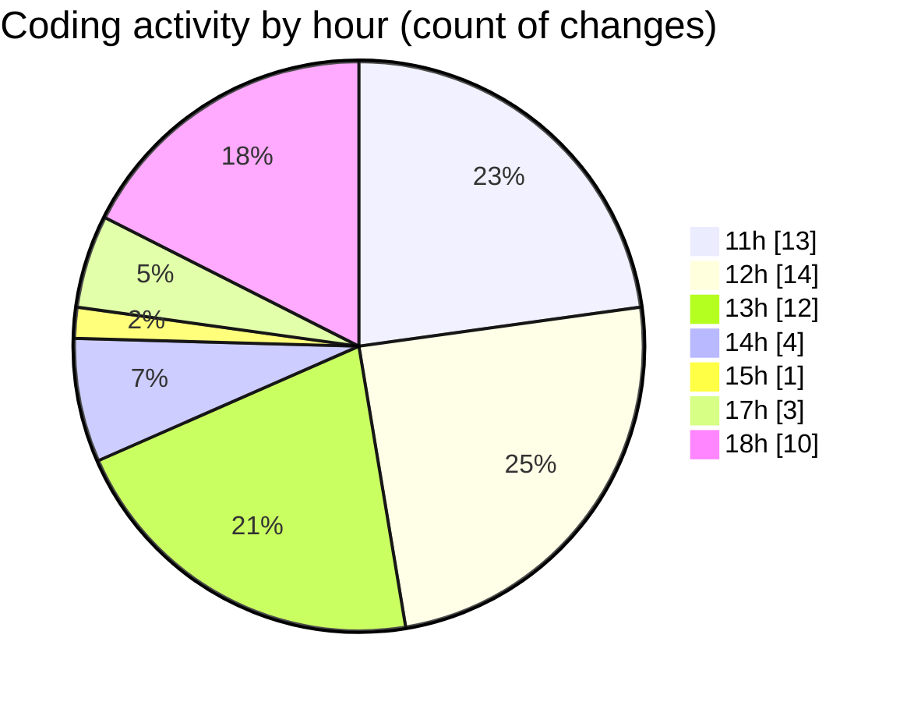

# nxtqube_webapp - Activity Summary 

## Overall Statistics

| Stat                   | Value                                                             |
| ---------------------- | ----------------------------------------------------------------- |
| **Lines Added** (➕)   | 6401                                          |
| **Lines Removed** (➖) | 1111                                        |
| **Net Change** (↕)    | 5290                |
| **Active Time** (⌚)   | 75 minutes |

## Modified Files
- **draw3D.js** (+920, -67)
- **edit3D.js** (+1701, -1038)
- **mission.controller.js** (+567, -0)
- **create3DMission.jsx** (+1476, -6)
- **Map.jsx** (+1737, -0)

## Visualizations

### By File Type (Lines Changed)

### By Hour (Estimated Activity Count)

> **Last Updated:** 29/12/2025, 18:44:01