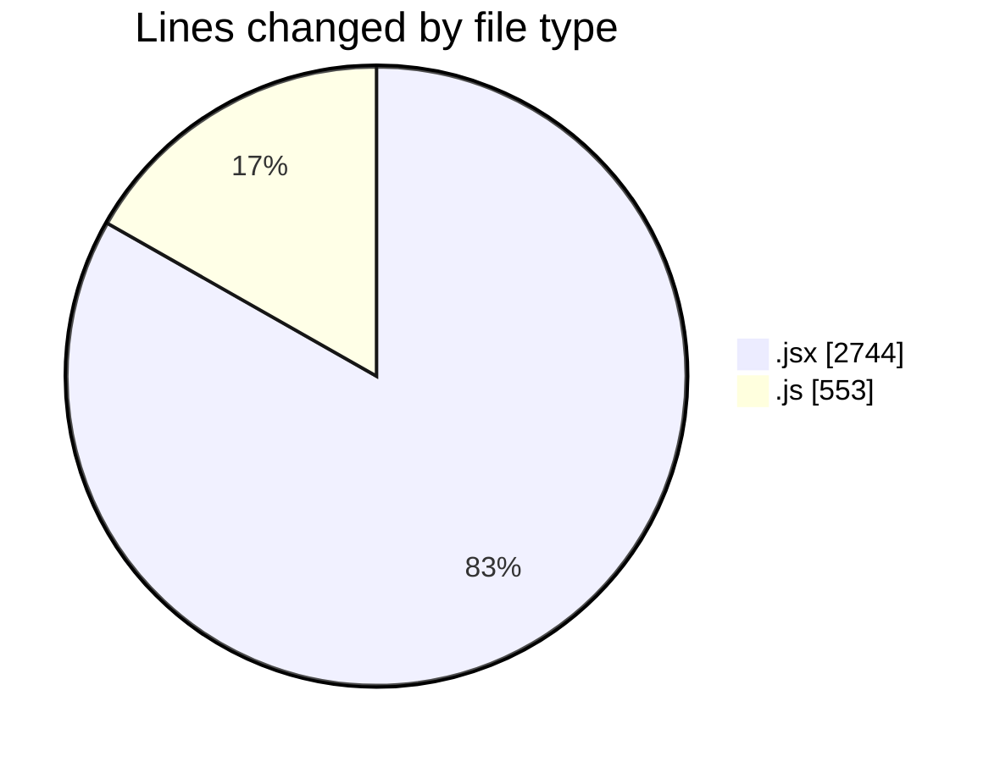
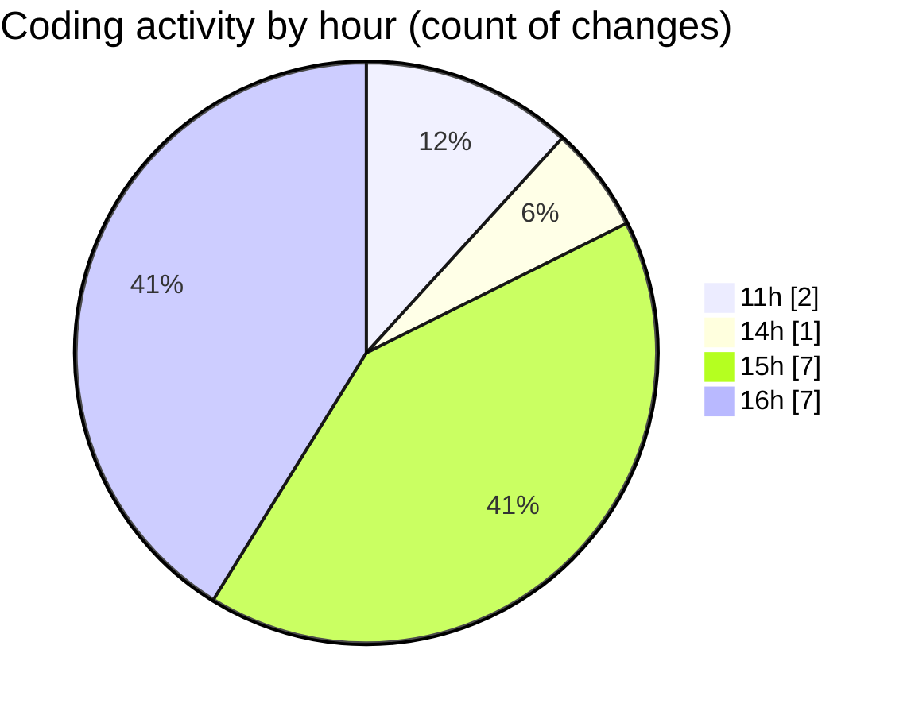

# nxtqube_webapp - Activity Summary 

## Overall Statistics

| Stat                   | Value                                                             |
| ---------------------- | ----------------------------------------------------------------- |
| **Lines Added** (➕)   | 3294                                          |
| **Lines Removed** (➖) | 3                                        |
| **Net Change** (↕)    | 3291                |
| **Active Time** (⌚)   | 25 minutes |

## Modified Files
- **create3DMission.jsx** (+1560, -0)
- **LaunchModel.jsx** (+463, -0)
- **launch.manager.js** (+158, -0)
- **mission3d.launch.manager.js** (+71, -0)
- **LaunchControl.jsx** (+721, -0)
- **mission3d.service.js** (+321, -3)

## Visualizations

### By File Type (Lines Changed)

### By Hour (Estimated Activity Count)

> **Last Updated:** 30/12/2025, 16:31:57