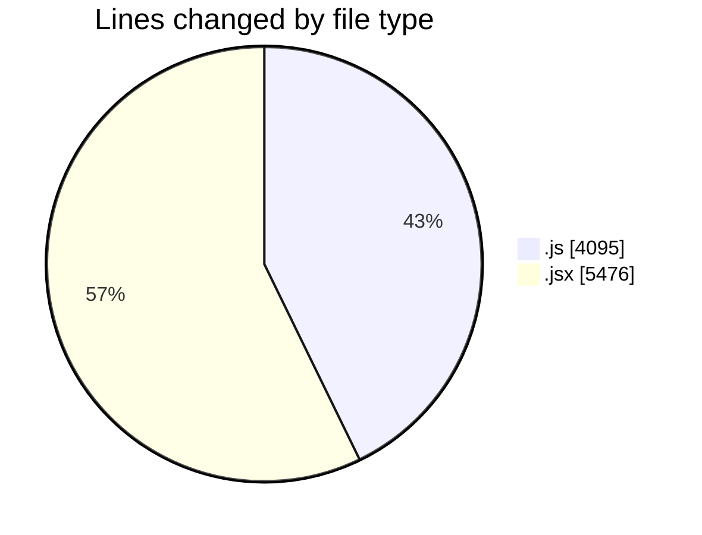
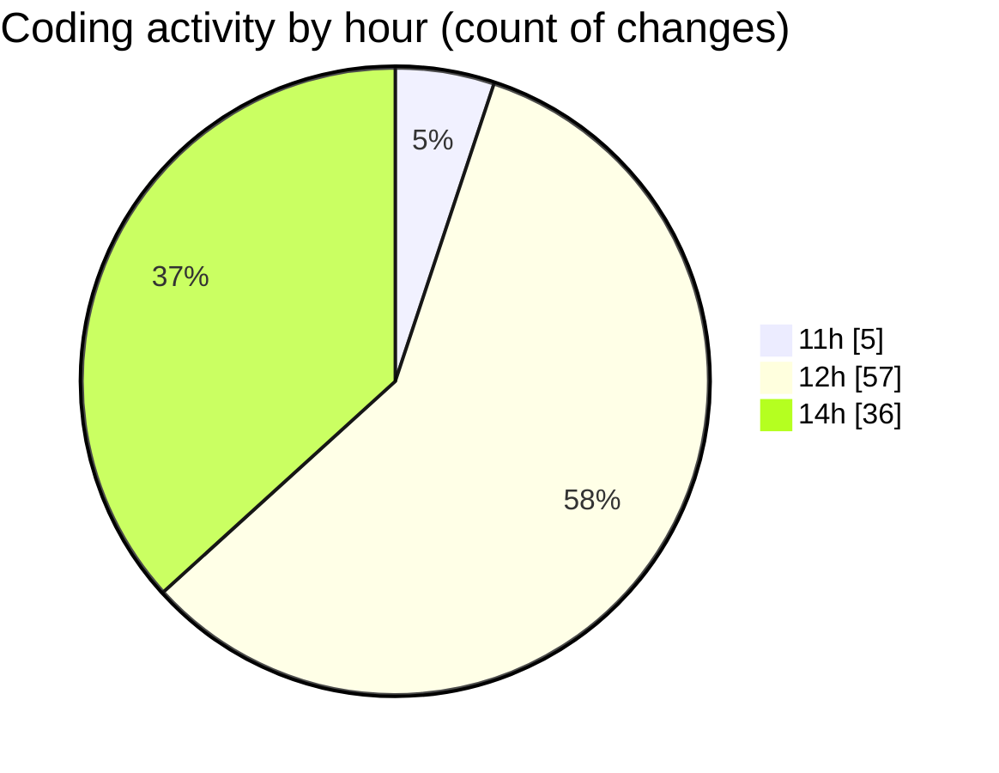

# nxtqube_webapp - Activity Summary 

## Overall Statistics

| Stat                   | Value                                                             |
| ---------------------- | ----------------------------------------------------------------- |
| **Lines Added** (➕)   | 9426                                          |
| **Lines Removed** (➖) | 145                                        |
| **Net Change** (↕)    | 9281                |
| **Active Time** (⌚)   | 110 minutes |

## Modified Files
- **launch.manager.js** (+151, -0)
- **LaunchControl.jsx** (+721, -40)
- **create3DMission.jsx** (+1560, -3)
- **LaunchModel.jsx** (+463, -8)
- **mission3d.service.js** (+335, -6)
- **mission3d.launch.manager.js** (+78, -8)
- **mission.controller.js** (+568, -30)
- **mission.route.js** (+47, -4)
- **Map.jsx** (+1737, -3)
- **draw3D.js** (+870, -22)
- **edit3D.js** (+670, -0)
- **useMissionDisplay.js** (+1225, -4)
- **Existing.jsx** (+254, -2)
- **ExistingMission.jsx** (+678, -7)
- **useEdit3DMission.js** (+69, -8)

## Visualizations

### By File Type (Lines Changed)

### By Hour (Estimated Activity Count)

> **Last Updated:** 31/12/2025, 14:24:17