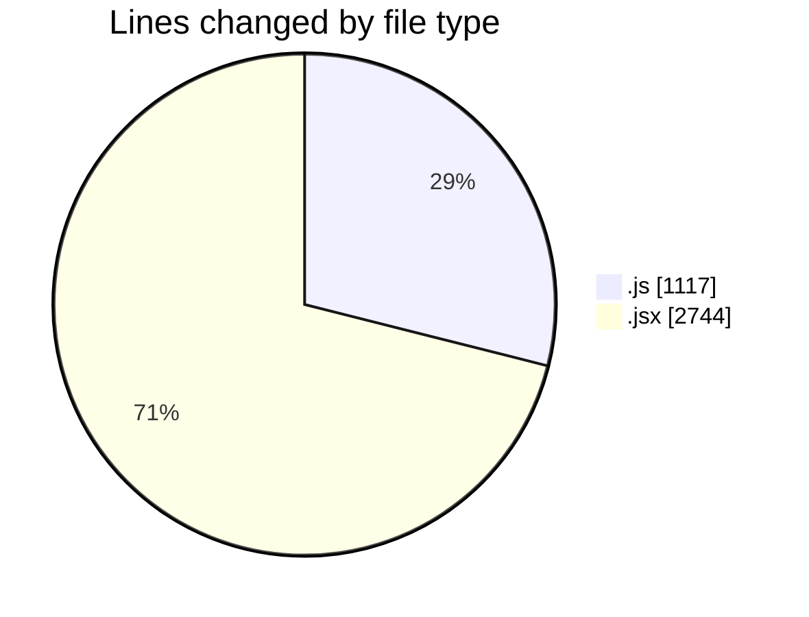
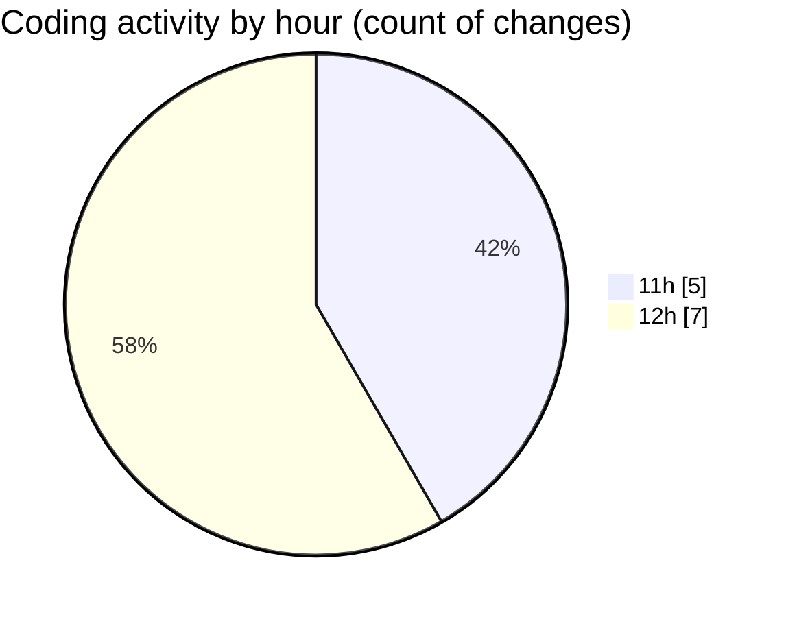

# nxtqube_webapp - Activity Summary 

## Overall Statistics

| Stat                   | Value                                                             |
| ---------------------- | ----------------------------------------------------------------- |
| **Lines Added** (➕)   | 3851                                          |
| **Lines Removed** (➖) | 10                                        |
| **Net Change** (↕)    | 3841                |
| **Active Time** (⌚)   | 14 minutes |

## Modified Files
- **launch.manager.js** (+151, -0)
- **LaunchControl.jsx** (+721, -0)
- **create3DMission.jsx** (+1560, -0)
- **LaunchModel.jsx** (+463, -0)
- **mission3d.service.js** (+318, -0)
- **mission3d.launch.manager.js** (+71, -0)
- **mission.controller.js** (+567, -10)

## Visualizations

### By File Type (Lines Changed)

### By Hour (Estimated Activity Count)

> **Last Updated:** 31/12/2025, 12:03:18